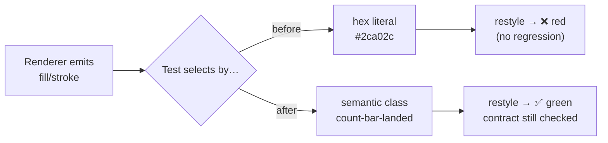

# Replace implementation palette hex literals with structural assertions

## Summary

Five SVG test files asserted the renderers' exact colour hex literals — values that could only have
been pasted from current output (one comment openly said it existed to guard a module-private
palette constant). The behavioural contract in every case is structural, so a pure restyle failed
five files with zero behavioural regression.

Each site now selects elements by a stable semantic `class` hook and asserts the behaviour instead
of the hex: each outcome category gets a **distinct** fill, the two complexity series use
**different** strokes, the MNIST hit/miss labels are **told apart** by colour, the mountain-car fill
keyframes **change** once the car crosses the flag. Closes #726.

### Per-site resolution

| Site                                        | Was                                    | Now                                                                                                                                                 |
| ------------------------------------------- | -------------------------------------- | --------------------------------------------------------------------------------------------------------------------------------------------------- |
| `common/outcome_bar_chart_test.ts`          | four hex literals per category         | fills read via `count-bar-<cat>` and asserted pairwise distinct, plus strip cell + legend swatch agreement per category                             |
| `common/multi_run_complexity_chart_test.ts` | polylines counted by `stroke="#…"`     | counted by `class="neurons-line-segment"` / `"synapses-line-segment"`; strokes asserted distinct                                                    |
| `common/multi_run_error_chart_test.ts`      | envelope located by `stroke="#d62728"` | located by `class="error-envelope"` (both the count and the points-extraction site)                                                                 |
| `mnist_classification_test.ts`              | `svg.includes("#2ecc71"/"#e74c3c")`    | correct vs wrong label fills read via `cell-label-correct` / `cell-label-wrong` and asserted different                                              |
| `mountain_car_test.ts`                      | `svg.includes("#2ecc71")`              | fill keyframe list extracted and asserted to hold exactly two colours on a crossing run — plus a **new** test that a failed run stays on one colour |

### Behaviour-neutral renderer enablers

The issue sanctions adding a `class` where one is missing. Four were added, no geometry or colour
changed:

- `common/outcome_bar_chart.ts` — legend swatch gains `legend-swatch-<cat>`.
- `common/multi_run_complexity_chart.ts` — each series polyline gains `<lineClass>-segment`.
- `common/multi_run_error_chart.ts` — the envelope polyline gains `error-envelope`.
- `mnist_classification/svg.ts` — the cell label gains `cell-label cell-label-correct|wrong`.

`AGENTS.md` gains a "how" test bullet recording the rule so the pattern is not reintroduced.

## Evidence

Backend/CLI change — no web interface to screenshot. Evidence is the test suite.

**Snapshot baselines regenerated.** `common/testdata/baseline_cx_10runs.svg` and
`baseline_err_10runs.svg` are byte-compared by two tests. Adding a class attribute changes those
bytes, so both were regenerated from the renderers. The diff is **only** the added `class="…"` —
every coordinate, stroke, fill and element ordering is unchanged, which is itself the proof the
enablers are behaviour-neutral.

**Mutation-checked.** Both new outcome-bar-chart assertions were verified to actually catch a
regression, not just pass:

| Injected fault                             | Result                  |
| ------------------------------------------ | ----------------------- |
| `crashed` given the same hex as `landed`   | ❌ fails (distinctness) |
| legend swatch fill hard-coded to `#000000` | ❌ fails (agreement)    |

**Test runs** (`< /dev/null` throughout):

```
deno test common/outcome_bar_chart_test.ts \
          common/multi_run_error_chart_test.ts \
          common/multi_run_complexity_chart_test.ts
  → ok | 50 passed | 0 failed

deno test --filter renderRunSVG mountain_car/mountain_car_test.ts
  → ok | 5 passed | 0 failed

deno test --filter renderDigitGridSVG mnist_classification/mnist_classification_test.ts
  → ok | 2 passed | 0 failed
```

`./quality.sh < /dev/null`: Deno Format ✅, Deno Lint ✅, Deno Type Check ✅, Unit Tests **1245
passed / 1 failed**. The single failure is
`crispr_injection_test.ts::runCrisprInjectionEvolution returns pre- and post-injection milestone
summaries`
— a pre-existing stochastic flake
(`post-injection finalScore (0.964) >= pre-injection
finalScore (0.987)`). It is unrelated to this
change: `crispr_injection/` imports none of the modified modules, and the test passes on an isolated
re-run.



## Test Plan

Modified (implementation-coupled → behavioural):

- `common/outcome_bar_chart_test.ts` — `fills each category with its outcome colour` replaced by
  `each outcome category gets a distinct fill` and
  `bar, strip cell and legend swatch agree per category`.
- `common/multi_run_complexity_chart_test.ts` —
  `happy path emits valid SVG with both polylines and
  dual axes` now counts by class and asserts
  the two strokes differ.
- `common/multi_run_error_chart_test.ts` — the envelope polyline is located by class in both the
  happy-path count and the monotonicity points-extraction test.
- `mnist_classification/mnist_classification_test.ts` —
  `renderDigitGridSVG emits an animated SVG
  with distinctly coloured hit/miss labels …` (renamed
  from "green/red labels").
- `mountain_car/mountain_car_test.ts` —
  `renderRunSVG switches the car's fill colour once the trace
  crosses the flag line` (renamed and
  rewritten).

Added:

- `mountain_car/mountain_car_test.ts` —
  `renderRunSVG keeps one fill colour when the trace never
  reaches the flag`, the negative case
  the old `includes("#2ecc71")` probe could not express.

No tests were commented out or deleted. Coverage strictly increases: the palette-distinctness,
cross-surface agreement, and never-reaches-flag contracts were not asserted before.
