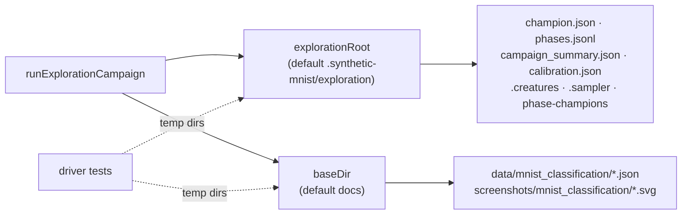

# PR Summary — Issue #727

## Summary

The MNIST exploration-campaign driver `runExplorationCampaign`
(`mnist_classification/exploration_campaign.ts`) had no direct test — the gap was masked by the
identically-named, well-tested `stock_market` driver. It could not be tested as written: every
artefact path was a module-level constant, so any driver-level test would have written into
`.synthetic-mnist/` and clobbered the committed `docs/` tree.

This PR makes both roots injectable and adds behaviour-based tests for the driver and the
recorded-evolution persistence helpers reachable only through it. Closes #727.

**Testability change (production behaviour unchanged — every new option defaults to today's path):**

| Option            | Default                        | Purpose                                                 |
| ----------------- | ------------------------------ | ------------------------------------------------------- |
| `explorationRoot` | `.synthetic-mnist/exploration` | Gitignored scratch (champion, phase log, pool)          |
| `baseDir`         | `docs`                         | Recorded artefacts (milestones, charts, summary)        |
| `evolveOverrides` | _(unset)_                      | Unit-test-only evolveDir caps — never set by the runner |

The same optional root threads through `phase_champions.ts`, `population_pool.ts`, and
`recorded_evolution.ts`; every existing call site keeps its current default.

**Fault fixed along the way:** `persistMnistRecordedPhase` and `wipeRecordedEvolution` accepted a
`baseDir` but wrote the prediction grid and run summary to the hardcoded `docs/...` constants
regardless — so a caller that redirected `baseDir` silently still mutated the committed tree. Both
now derive their paths from `baseDir` via the new `mnistScreenshotPath()` /
`mnistRunSummaryDocsPath()` helpers.

## Evidence

Backend/CLI change — no web interface to screenshot. Evidence is the new test suites plus the
verified absence of working-tree pollution (`git status` clean apart from the intended source
changes after every run).



```text
$ deno test mnist_classification/exploration_campaign_driver_test.ts
ok | 5 passed | 0 failed (12s)

$ deno test mnist_classification/recorded_evolution_test.ts
ok | 5 passed | 0 failed (1s)

$ deno test mnist_classification/{population_pool,phase_champions,exploration_campaign,mnist_classification}_test.ts
ok | 63 passed | 0 failed (2s)   # pre-existing suites, unchanged
```

## Test Plan

New `mnist_classification/exploration_campaign_driver_test.ts` (evolveDir-backed, so it runs in
isolated processes alongside `evolve_integration_test.ts` in `quality.sh` and CI):

- `runExplorationCampaign records one phase per schedule entry and persists the campaign` — two
  minimal phases over a tiny synthetic `.bin` set; asserts one phase record per configured phase
  with that phase's settings, the champion contract (`common/champion_contract.ts`), the appended
  `phases.jsonl`, `champion.json`, `campaign_summary.json`, the sampler-loop and phase-champion
  archives, and the milestones / three chart SVGs / prediction grid / run summary under `baseDir`.
- `runExplorationCampaign resumes from the persisted champion on a second invocation` — second call
  passes no seed export and must pick up the saved champion; asserts two milestones and two logged
  phases.
- `runExplorationCampaign rejects when there is no saved champion and no --fresh`.
- `loadExplorationCalibration round-trips a persisted calibration record` — including that a
  wrong-length ladder is rejected rather than half-applied.
- `calibrateTrainingSampleRate derives a four-rung ladder from a probe run`.

New `mnist_classification/recorded_evolution_test.ts` (fast, parallel-safe):

- `phaseResultToMultiRunSample` maps generations, error, and topology onto the milestone shape.
- `renderMnistRecordedCharts` writes no charts when there is no history.
- `persistMnistRecordedPhase` writes milestones, charts, grid SVG, and run summary **under the given
  base dir** — the regression test for the hardcoded-path fault above.
- `persistMnistRecordedPhase` appends a second phase with monotonic cumulative generations.
- `wipeRecordedEvolution` removes the artefacts under the base dir it was given.

No existing test was modified, commented out, or removed.

## Deno regression avoided

Stayed entirely on Deno-native tooling — `deno test` / `deno fmt` / `deno lint`, `Deno.makeTempDir`
for all fixture I/O. No Node tooling or dependency was introduced.

## Security self-check

- Input validation: no new external input surface — new options are internal path overrides used by
  tests and the existing CLI.
- Secrets: none staged; all new test artefacts go to `Deno.makeTempDir()` paths.
- Injection surface: no new shell, SQL, or HTTP calls.
- Error handling: the campaign still fails loud (`No saved champion — pass --fresh …`), now covered
  by a test.
