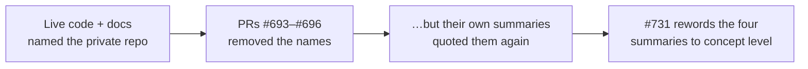

# Reword private-repo mentions in archived PR summaries 693–696 to concept level

## Summary

Four archived pull-request summaries — `pr-summary-693.md`, `pr-summary-694.md`, `pr-summary-695.md`
and `pr-summary-696.md` — still named a private production repository by owner/slug. They are the
summaries of the very PRs that removed those name mentions from the live code, docs and older
archives, so each one re-introduced the reference it had just removed: the prose named the private
slug directly, and the before/after tables reproduced the removed naming phrases verbatim.

Every mention is now reworded to concept level. Prose says "a private production repository"; the
"Before" column of each change table now _describes_ the removed wording (e.g. "a phrase naming the
private repository's market-prediction use case") instead of quoting it. The verification bullets
that quoted the grep command are reworded the same way. No summary was deleted and no historical
claim changed — only the naming. Closes #731.

This summary itself is written at concept level for the same reason, so the fix does not recreate
the reference a third time.

## Evidence

No web interface to screenshot — this is a documentation-only wording change in archived summaries.
Verified by:

- A repo-wide case-insensitive grep for the private repository's name now returns **no matches**
  anywhere in the working tree (it previously matched 27 lines across the four files).
- `deno fmt --check` and `deno lint` pass.
- `./quality.sh` — unit tests and every example runner pass unchanged; no code was touched.

The recurrence this closes:

## Test Plan

No new tests. The change alters only prose in archived documentation, so the only test that could
observe it would have to grep files for specific strings — an explicitly forbidden "how" test under
[AGENTS.md § Testing Philosophy](../../../AGENTS.md#-testing-philosophy). This matches the precedent
set by the sibling private-repo-reference fixes in [`pr-summary-693.md`](pr-summary-693.md),
[`pr-summary-695.md`](pr-summary-695.md) and [`pr-summary-696.md`](pr-summary-696.md), which were
likewise wording-only and added no new tests.

Existing coverage is unchanged and still passes: `deno fmt --check` and `deno lint` cover the edited
markdown, and the full unit-test suite plus every example runner in `./quality.sh` confirm nothing
executable moved.
