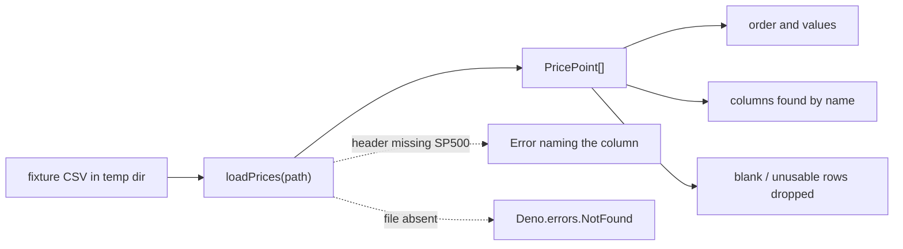

# Direct behavioural tests for `loadPrices` (Issue #742)

## Summary

`stock_market/stock_market.ts:738` exported `loadPrices(path)` with no test referencing it. It sits
on the example's critical data path — it turns the on-disk dataset into the `PricePoint[]` every
downstream stage consumes — so a column reorder, a header tweak, or a row-filtering change could
silently alter what the example trains on while the suite stayed green.

Added six "what" tests to `stock_market/stock_market_test.ts` that exercise `loadPrices` through its
observable contract: fixture CSVs written to a temp dir, real calls, assertions on the returned
records and on the documented failure modes. No production code changed. Closes #742.

## Evidence

Backend/CLI change — no web interface to screenshot. Evidence is the test run plus a mutation check.

Targeted run (all six new cases pass against the current implementation):

```text
running 6 tests from ./stock_market/stock_market_test.ts
loadPrices reads a dataset file into ordered PricePoint records ... ok (1ms)
loadPrices locates columns by name, not position ... ok (356µs)
loadPrices drops blank and unusable rows ... ok (370µs)
loadPrices returns no points for a header-only or empty file ... ok (543µs)
loadPrices throws when the header lacks the required columns ... ok (378µs)
loadPrices rejects when the dataset file is missing ... ok (319µs)

ok | 6 passed | 0 failed | 35 filtered out (4ms)
```

Mutation check — the tests genuinely bite. Replacing the by-name `SP500` column lookup with a
hard-coded positional index (the exact refactor the issue warns about) turns the suite red:

```text
FAILURES

loadPrices locates columns by name, not position
loadPrices throws when the header lacks the required columns

FAILED | 4 passed | 2 failed | 35 filtered out
```

The mutation was reverted; only the test file is modified by this PR.



## Test Plan

Added to `stock_market/stock_market_test.ts` (helper `withDatasetFile` writes each fixture to a
`Deno.makeTempDir()` and removes it afterwards):

- `loadPrices reads a dataset file into ordered PricePoint records` — happy path; asserts count,
  date order, and parsed close values.
- `loadPrices locates columns by name, not position` — header with `SP500` first and `Date` last
  still parses correctly, pinning the by-name lookup.
- `loadPrices drops blank and unusable rows` — blank line, unparseable price, non-positive price,
  and missing date are all skipped.
- `loadPrices returns no points for a header-only or empty file` — boundary case.
- `loadPrices throws when the header lacks the required columns` — asserts the rejection names the
  missing column.
- `loadPrices rejects when the dataset file is missing` — asserts `Deno.errors.NotFound`.

No existing tests were modified or removed.
