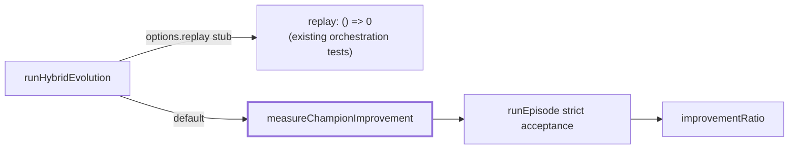

# PR Summary — Direct tests for `measureChampionImprovement`

## Summary

`tsp_two_opt/hybrid.ts` exports `measureChampionImprovement` as the **default** occupant of
`runHybridEvolution`'s `replay` seam, but every hybrid orchestration test injected
`replay: () => 0`, so nothing exercised the function that every non-test caller actually runs. This
PR adds behaviour-based ("what") tests that call it directly, plus one orchestration test that
leaves the seam at its default. No production code changed. Closes #743.

## Evidence

Backend/CLI change with no web interface, so no screenshot applies — the evidence is the test run
and a mutation check.

The seam and its previously-untested default occupant:



**Mutation check** — flipping the improvement delta in `environment.ts` (`seedLength - finalLength`
→ `finalLength - seedLength`) turns the new tests red, confirming they bite:

```
measureChampionImprovement — reports the fraction by which the champion shortened the seed tour ... FAILED
runHybridEvolution — with no replay override, each chunk records the real champion improvement ... FAILED
FAILED | 15 passed | 2 failed
```

Reverted, the file passes:

```
ok | 17 passed | 0 failed (40ms)
```

## Test Plan

Added to `tsp_two_opt/hybrid_test.ts` (deterministic champions built with `makeCreatureExport` per
AGENTS.md — no hand-rolled `CreatureExport`):

- `measureChampionImprovement — reports the fraction by which the champion
  shortened the seed tour`
  — recomputes the expected ratio independently from the nearest-neighbour seed length and the
  champion's final tour, and asserts at least one champion reports a positive improvement (a flipped
  delta clamps every champion to zero).
- `measureChampionImprovement — reports exactly zero when no 2-opt swap can
  improve the tour` — a
  three-city instance where no reversal can shorten the tour, so the answer is zero by construction
  whatever the champion proposes.
- `measureChampionImprovement — is deterministic, bounded in [0, 1], and never
  worsens with a bigger budget`
  — repeat calls agree, the ratio stays inside its documented range, and a larger proposal budget
  never reports less improvement under strict acceptance.
- `runHybridEvolution — with no replay override, each chunk records the real
  champion improvement`
  — omits `replay` so the orchestrator runs its production default and each chunk's
  `improvementRatio` matches the measured value.

The existing stubbed orchestration tests are unchanged — they pin a different contract (the wiring
around the seam).
