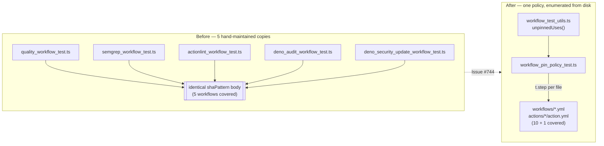

# PR Summary — Collapse the copy-pasted workflow policy tests (Issue #744)

## Summary

The `.github/*_workflow_test.ts` suite repeated the same SHA-pin test body in five files and
copy-pasted `loadWorkflow()` into all twelve. Both duplications are removed. Closes #744.

- **New `.github/workflow_test_utils.ts`** — single home for `loadWorkflow()`, `triggers()`, the
  workflow/composite-action enumerators, and the pin policy itself (`unpinnedUses()`). All twelve
  per-workflow suites now import it instead of carrying their own copies.
- **New `.github/workflow_pin_policy_test.ts`** — data-driven: it enumerates
  `.github/workflows/*.yml` and `.github/actions/*/action.yml` from disk and runs one `t.step` per
  file. A newly added workflow is therefore gated the moment it is committed, which the per-file
  copies never guaranteed.
- **Deleted the five identical pin tests** (`quality`, `semgrep`, `actionlint`, `deno_audit`,
  `deno_security_update`) and the two inline pin assertions in `setup_deno_env_action_test.ts`. Each
  per-workflow file keeps only its workflow-specific contracts (container digest pinning,
  `markdownlint-cli2` version pinning, env-passing rules, permissions, triggers).

Net effect: 368 lines deleted, 99 added across the twelve suites, and pin coverage widens from 5
workflows to **10 workflows + 1 composite action**.



## Evidence

This is a CI/test-only change with no web interface, so there is no screenshot. The gate was proven
to fail loudly rather than merely passing on an already-compliant tree: `actions/checkout` in
`dependency-review.yml` — a workflow that had **no** pin test before this change — was temporarily
downgraded from its SHA to `@v4`, and the new suite failed with a precise location:

```text
pin policy — every workflow pins each uses: to a 40-char commit SHA ... dependency-review.yml ... FAILED
AssertionError: dependency-review.yml: the following must pin its action to a 40-character
commit SHA. See the supply-chain hardening rules in AGENTS.md.
-   [
-     "job 'dependency-review' step 'Check out repository' uses 'actions/checkout@v4'",
-   ]
+   []
```

The workflow was restored immediately (`git diff` clean). With the tree restored, the whole
`.github` suite is green:

```text
deno test --allow-read --allow-write --allow-run --allow-env .github/
ok | 102 passed (11 steps) | 0 failed (1s)
```

## Test Plan

Added in `.github/workflow_pin_policy_test.ts`:

- `pin policy — every workflow pins each uses: to a 40-char commit SHA` — one `t.step` per file
  discovered under `.github/workflows`.
- `pin policy — every local composite action pins each uses: to a 40-char commit SHA` — one `t.step`
  per action discovered under `.github/actions`.
- `pin policy — flags a tag-pinned action in a workflow job` — hand-built document; asserts the
  offending step is named and the pinned sibling is not flagged.
- `pin policy — flags a branch pin and a short SHA in a composite action` — asserts both weak pin
  forms are caught inside `runs.steps`.
- `pin policy — exempts local ./ composite actions and steps with no uses:` — pins the Issue #682
  carve-out.
- `pin policy — a document with no jobs or steps yields no references` — empty/edge input.

Removed (superseded by the above, identical bodies): the `every uses: pins a 40-char commit SHA`
test in `quality_workflow_test.ts`, `semgrep_workflow_test.ts`, `actionlint_workflow_test.ts`,
`deno_audit_workflow_test.ts`, `deno_security_update_workflow_test.ts`, plus the two inline
`/@[0-9a-f]{40}\b/` assertions in `setup_deno_env_action_test.ts`. No behavioural contract was
dropped — every one of those assertions is now made by the parametrised suite, over a strictly
larger set of files.

All other tests in the twelve suites are unchanged; only their helper imports were rewritten.
