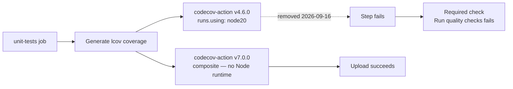

# Bump codecov-action off the deprecated node20 runtime

## Summary

`.github/workflows/quality.yml` pinned `codecov/codecov-action` to
`b9fd7d16f6d7d1b5d2bec1a2887e65ceed900238` (`# v4.6.0`), whose `action.yml` declares
`runs.using: 'node20'`. GitHub removes the node20 runner on 2026-09-16; after that the upload step
fails outright, and because `unit-tests` feeds the required `Run quality checks` aggregate job, a
broken upload step would take the required status check down with it.

Bumped to `codecov/codecov-action` v7.0.0 (`fb8b3582c8e4def4969c97caa2f19720cb33a72f`), keeping the
40-character SHA pin. v7 is a `composite` action, so it carries no Node runtime at all and cannot be
caught by a future Node deprecation. The `with:` block is unchanged — v7 still accepts `files`,
`token` and `fail_ci_if_error`. Closes #746.

Verification performed against the pinned SHA before committing:

- `gh api repos/codecov/codecov-action/commits/v7.0.0 --jq '.sha'` →
  `fb8b3582c8e4def4969c97caa2f19720cb33a72f`
- `action.yml` at that SHA → `using: "composite"` (line 176)
- inputs `files`, `token`, `fail_ci_if_error` all still declared
- released 2026-06-07, well outside the 24 h `VIBE_BUMP_QUARANTINE_HOURS` window (external
  dependency, per Issue #1613)

## Evidence

Workflow-only change — no web interface to screenshot. Evidence is the new test suite, which fails
against the old pin and passes against the new one:

```text
$ deno test --allow-read codecov_action_runtime_test.ts   # before the bump
the Codecov upload step is pinned to a composite-action major ... FAILED
no workflow step pins an action known to use a withdrawn runtime ... FAILED
FAILED | 1 passed | 2 failed

$ deno test --allow-read codecov_action_runtime_test.ts   # after the bump
ok | 3 passed | 0 failed
```



## Test Plan

Added `codecov_action_runtime_test.ts` — parses `quality.yml` and asserts on the step's effective
configuration:

- `the Codecov upload step is pinned to a composite-action major` — the single
  `codecov/codecov-action` step stays SHA-pinned (40 hex chars) and its version comment is `>= v7`,
  the first composite major.
- `no workflow step pins an action known to use a withdrawn runtime` — regression test for this
  issue: no step pins a SHA on the withdrawn-runtime deny-list (currently the v4.6.0 node20 commit).
- `the Codecov upload step keeps its inputs after the bump` — `files`, `fail_ci_if_error` and the
  `CODECOV_TOKEN` secret survive the version change.

The full `./quality.sh` gate was run and passes.
