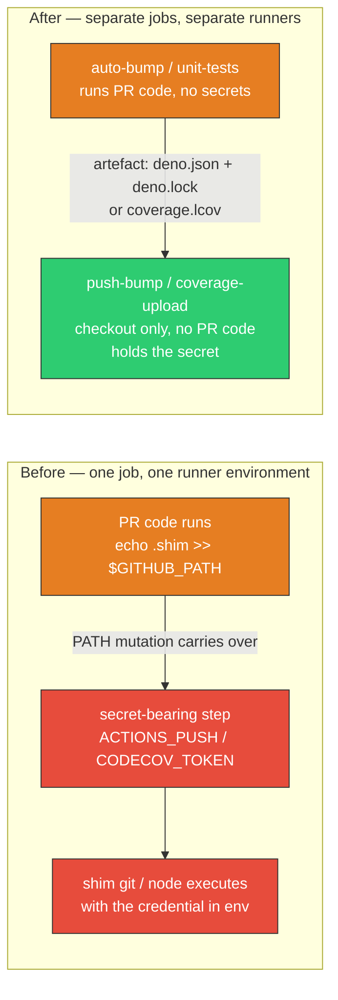

# Split secret-bearing steps out of jobs that run pull-request code (#747)

## Summary

Two jobs executed pull-request-authored code and then handed a secret to a later step **in the same
job**, leaving one step-boundary-crossing primitive open after Issue #678: `$GITHUB_PATH`. Anything
a step appends to that file is prepended to `PATH` for every subsequent step in the job, and it is
not on the runner's blocked list — so PR code could drop a shim named `git` (auto-bump) or `node`
(the `node20` Codecov action) onto `PATH` and have it execute inside the secret-bearing step,
reading `ACTIONS_PUSH` / `CODECOV_TOKEN` straight out of that step's own process environment.
`persist-credentials: false` does not help, because the credential is never in the workspace.

The fix takes the issue's preferred option — break the shared-job boundary rather than patch the
same job. A fresh job gets a fresh runner environment, so neither `$GITHUB_PATH` nor `$GITHUB_ENV`
carries over, and the payload crosses as an artefact (inert data, not an environment).

- **`.github/workflows/deno-outdated.yml`** — `auto-bump` now runs `bump-deps.sh` and uploads the
  bumped `deno.json` / `deno.lock` as an artefact, exposing a `pushed` job output. A new `push-bump`
  job downloads that artefact, commits, and pushes with the org `ACTIONS_PUSH` PAT. `push-bump`
  checks the PR head out for files only — it runs no local `./` composite action and no PR script.
  The artefact is unpacked into a scratch directory and only the two expected manifests are copied
  across, so a forged artefact cannot write into `.git/` (where a planted hook or `core.*` helper
  would otherwise execute during the commit, with the PAT in env).
- **`.github/workflows/quality.yml`** — `unit-tests` now publishes `coverage.lcov` as an artefact
  instead of uploading it inline. A new `coverage-upload` job consumes the artefact and supplies
  `CODECOV_TOKEN`. The upload stays outside the aggregate `Run quality checks` gate and keeps
  `fail_ci_if_error: false`, so a Codecov outage still cannot block a PR.

Behaviour is otherwise unchanged: the same commit message, the same fork guard, the same
`workflow_dispatch` fallbacks, the same read-only `GITHUB_TOKEN` grant.

Closes #747.

## Evidence

This is a CI/workflow change with no web interface, so there is no screenshot. Verification is the
new test suite plus `actionlint`, which parses both workflows cleanly.



Regression evidence — all six new tests fail against the unfixed workflows and pass after the split:

```text
# before the workflow change
FAILED | 0 passed | 6 failed (69ms)

# after
ok | 6 passed | 0 failed (13ms)
```

`actionlint .github/workflows/deno-outdated.yml .github/workflows/quality.yml` → clean.

## Test Plan

New — `workflow_secret_job_isolation_test.ts`:

- `<workflow>: no job runs PR code and a secret-bearing step together` (one case per workflow) — the
  general invariant. A job may not contain both a step that executes workspace code (a local `./`
  composite action, `bump-deps.sh`, `deno test`, `quality.sh`, a `run.sh`, a sourced `common/`
  helper) and a step that references `secrets.`.
- `deno-outdated pushes from a job that never runs PR code` — the PAT-bearing job executes no
  pull-request-authored step, and still authenticates as the org PAT (#651 unchanged).
- `deno-outdated hands the bump between jobs as an artefact` — bump and push live in different jobs,
  linked by upload/download-artifact, `needs`, and a `pushed`-gated job `if`.
- `quality uploads coverage from a job that never runs the PR test suite` — the Codecov job is
  distinct from the `deno test` job and consumes the lcov artefact.
- `every secret-bearing checkout keeps credentials out of the workspace` — any `actions/checkout` in
  a secret-bearing job sets `persist-credentials: false`.

Modified (business-logic change documented — the push moved from a step to a job):

- `deno_workflow_push_credential_test.ts` — step lookups now flatten every job of the workflow
  instead of reading `jobs["auto-bump"].steps`, so the #651 PAT assertions still find the push step
  in its new `push-bump` home. Assertions unchanged.
- `deno_workflow_credential_scope_test.ts` — same flattening for the #678 assertions.
  `deno-outdated push step is gated on the bump having produced a commit` is renamed to
  `deno-outdated push is gated on the bump having produced a commit` and now accepts the gate on
  either the step `if` or the owning job's `if`; the gate itself moved to the job level, so the
  guarantee ("no push without a bump") is identical.
- `deno_workflow_permission_scope_test.ts` — `stepsOf` now sweeps every job rather than one named
  job, widening the "no GITHUB_TOKEN write" check to cover `push-bump` too.

No tests were removed or commented out.

Documentation — README gains a **Secrets never share a job with pull-request code** subsection under
_Dependency-update channels_, explaining the `$GITHUB_PATH` primitive and showing the artefact
hand-off in a Mermaid diagram.

## Security self-check

- **Input validation** — no new functions accepting external input; the artefact carries data
  (`deno.json`, `deno.lock`, `coverage.lcov`) that is committed/uploaded exactly as before.
- **Secrets** — no credentials staged. `ACTIONS_PUSH` and `CODECOV_TOKEN` now reach strictly fewer
  runner environments than before.
- **Injection surface** — no new shell interpolation; the push command is byte-for-byte the previous
  one.
- **Authentication** — the push is still a PAT push (#651) and `GITHUB_TOKEN` stays
  `contents: read`.
- **Dependencies** — two new pinned actions, both external and well past the 24h quarantine (#1613):
  `actions/upload-artifact@043fb46d1a93c77aae656e7c1c64a875d1fc6a0a` (v7.0.1, published 2026-04-10)
  and `actions/download-artifact@3e5f45b2cfb9172054b4087a40e8e0b5a5461e7c` (v8.0.1, published
  2026-03-11). Both pinned to 40-char commit SHAs, not tags.
