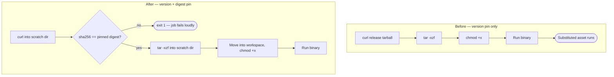

# Verify downloaded CI binaries against a pinned SHA-256

## Summary

The `actionlint` and `gitleaks` workflows each downloaded a release tarball and
executed the extracted binary without checking a single byte. Both pinned an
exact upstream *version*, but a GitHub release asset is mutable — a maintainer,
or anyone who compromises the upstream account, can delete and re-upload an
asset under an existing tag. The version pin therefore constrained *which
release* was fetched while saying nothing about *what bytes* arrived. That is
the same gap the 2025 tj-actions and 2026 TanStack incidents turned into CI
compromise: `gitleaks` runs after a `fetch-depth: 0` checkout, so a substituted
binary would see the repository's entire history, and `actionlint` is the gate
meant to catch unsafe workflow patterns, so a substituted binary could simply
report success.

Both downloads now go through a new `.github/scripts/install_verified_tool.sh`,
which fetches the tarball into a scratch directory, compares its SHA-256 against
a digest committed next to the version pin, and only then extracts the binary
into the workspace. A substituted asset fails the job loudly instead of
executing.

The digest is pinned in the workflow rather than read from the upstream
`*_checksums.txt`, as the issue's stronger option suggested: a checksums file
served from the same origin as the tarball is compromised by the same attacker.
Bumping the version now means bumping the digest alongside it, and the existing
comments in both workflows say so.

Pinned digests, verified against both the upstream checksums file and an
independent download:

| Tool       | Version | SHA-256                                                            |
| ---------- | ------- | ------------------------------------------------------------------ |
| actionlint | 1.7.12  | `8aca8db96f1b94770f1b0d72b6dddcb1ebb8123cb3712530b08cc387b349a3d8` |
| gitleaks   | 8.30.1  | `551f6fc83ea457d62a0d98237cbad105af8d557003051f41f3e7ca7b3f2470eb` |

Closes #748.

## Evidence

This is a CI/supply-chain change with no web interface, so there is no
screenshot to capture. The evidence is the test suite below plus the local
`actionlint` run over both modified workflows, which reported no findings.

Before and after, for the install step of both workflows:

The gate is proven, not merely asserted: with the two workflow changes stashed,
the new `download policy — no workflow runs an unverified downloaded binary`
test fails for both `actionlint.yml` and `gitleaks.yml`, and passes once the
fix is applied.

## Test Plan

### Added — `.github/install_verified_tool_test.ts`

End-to-end "what" tests that run the real script against real tarballs built in
a temp directory and served over `file://`, so no test touches the network:

- `extracts an executable binary when the digest matches` — the binary lands in
  the destination, is executable, and runs.
- `rejects a substituted tarball and never extracts it` — a second tarball
  standing in for a re-uploaded release asset fails with a mismatch and leaves
  nothing behind. This is the regression test for the reported vulnerability.
- `fails loudly on a malformed or empty pinned digest` — an empty, truncated,
  non-hex or uppercase digest is rejected rather than silently matched.
- `fails when the download itself fails` — an unreachable asset fails the job.
- `rejects a binary name that escapes the destination` — `../escaped`,
  `/etc/passwd` and `sub/payload` are refused.
- `reports usage instead of guessing when arguments are missing`.

### Added — `.github/workflow_pin_policy_test.ts`

A repository-wide policy so a *future* workflow cannot reintroduce the hole:

- `no workflow runs an unverified downloaded binary` — enumerates every file
  under `.github/workflows/` from disk, so a new workflow is covered the moment
  it is committed.
- Four unit tests exercise the policy helper against hand-built documents: a
  hand-rolled `curl`, a bare `wget`, a download whose digest comes from a
  fetched checksums file rather than a pin, and a compliant helper call.

### Added — `.github/actionlint_workflow_test.ts`

- `installs the binary against a pinned SHA-256 (Issue #748)` — the install step
  routes through the verifier and pins a 64-character digest.

### Modified — `.github/gitleaks_workflow_test.ts`

`Install Gitleaks completes under strict mode` previously stubbed `curl` and
`tar` to drive the download logic that lived inline in the `run:` block. That
logic now lives in `install_verified_tool.sh` and is covered end-to-end by its
own suite, so the test stubs the verifier instead and asserts what remains this
step's responsibility: it still completes under `set -euo pipefail`, and it
hands the verifier the pinned release asset URL, a 64-character digest, and the
`gitleaks` binary name. No assertion was weakened — coverage of the download
path moved to the new suite and grew from one happy-path case to six.

### Not modified

No existing test was removed or commented out. `./quality.sh` passes.
