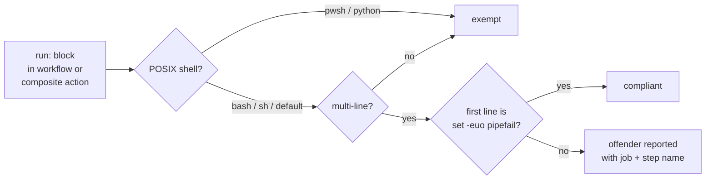

# Enforce `set -euo pipefail` across every workflow `run:` block

## Summary

Issue #750 reported two multi-line `run:` blocks missing the strict-mode preamble. Both YAML lines
had already been corrected in commit `52fc79d` (Issue #746), so the tree is compliant today — but
nothing stopped either from regressing, because the preamble was asserted for `gitleaks.yml` alone.

This PR closes the gap the issue itself flagged: it promotes the convention from a per-workflow
assertion to a repository-wide policy. `missingStrictMode()` joins the existing pin and download
policies in `.github/workflow_test_utils.ts`, and a new suite applies it to every file under
`.github/workflows/` and `.github/actions/` enumerated from disk, so a new workflow is covered the
moment it is committed. Closes #750.

Why it matters: GitHub's default shell is `bash -e {0}` — `errexit` only. Without `-u` and
`pipefail`, an unset variable expands to an empty string and a mid-pipeline failure is masked by the
last command's exit status. In `deno-security-update.yml` that hazard was live: the advisory gate
ran under `set -uo pipefail`, so a failed `echo … >> "$GITHUB_OUTPUT"` would have left
`steps.audit.outputs.advisory` empty, silently skipping both patch steps while the daily security
run reported success — a fail-silent security channel.

Scope notes:

- Single-line `run:` blocks are exempt — the default `-e` already propagates a sole command's exit
  status.
- Steps declaring a non-POSIX `shell:` (`pwsh`, `python`) are exempt; `runSteps()` now carries the
  step's `shell` so the gate cannot produce a false failure on one.
- The existing `gitleaks.yml` assertion is left in place.

## Evidence

Backend/CI change with no web interface, so no screenshot applies. The evidence is that the new gate
reproduces the reported defect. Temporarily restoring the pre-fix state (`set -uo pipefail` in
`deno-security-update.yml`, no `set` line in `quality.yml`) turns the repository-wide test red on
exactly those two files and nothing else:

```text
  deno-security-update.yml ... FAILED (14ms)
  quality.yml ... FAILED (1ms)
strict mode — every workflow's multi-line run: blocks enable it ... FAILED (due to 2 failed steps)
```

Restored to the committed tree, all 9 tests / 11 steps pass.



## Test Plan

New suite `.github/strict_mode_policy_test.ts`:

- `every workflow's multi-line run: blocks enable it` — enumerates `.github/workflows/*.yml` from
  disk, one sub-step per workflow (10 covered).
- `every composite action's multi-line run: blocks enable it` — same for
  `.github/actions/*/action.yml`.
- `flags a block that omits -e` — the `deno-security-update.yml` shape from the issue.
- `flags a block with no set line at all` — the `quality.yml` symlink-step shape from the issue.
- `flags a composite step and reports every offender` — proves offenders are not truncated at the
  first.
- `accepts a compliant block with trailing blank lines`.
- `exempts single-line run: blocks` and `exempts non-POSIX shells` — guard against false failures.
- `a document with no jobs or steps yields no offenders`.

Modified `.github/workflow_test_utils.ts`: added `missingStrictMode()` and `STRICT_MODE_PREAMBLE`,
and extended `RunStep` with the optional `shell` field. No existing test was changed or removed.

Full `./quality.sh` run passes.
