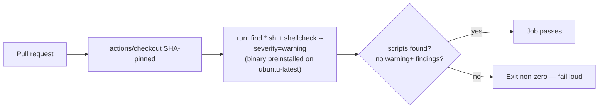

## Summary

The `shellcheck` CI job wrapped `koalaman/shellcheck` in the third-party
`ludeeus/action-shellcheck` action, which is **ORPHAN-STALE** — no release since
2023-01 (~42 months), no push to the source repository since 2024-06 (~25
months), `archived: false`, and a dozen unreviewed pull requests. Because the
action was SHA-pinned to a dormant repository, no fix could ever arrive through
the ordinary dependency-bump flow, and the bundled ShellCheck version would
drift further behind upstream indefinitely.

Rather than swapping one wrapper for another, this PR removes the orphaned
dependency **at the root**: the job now invokes the `shellcheck` binary that is
preinstalled on `ubuntu-latest` runners directly via a `run:` step. There is no
dormant SHA left to track, and the lint follows the actively maintained runner
image's ShellCheck version. This matches how the sibling repositories resolved
the same finding (`stSoftwareAU/NEAT-AI#3426`,
`stSoftwareAU/NEAT-AI-Discovery#1898`) and keeps the gate owned by this
repository.

Behaviour is preserved:

- **File discovery** mirrors `scandir: .` — every `*.sh` file in the tree,
  recursively, excluding `.git`, `node_modules`, and the vendored
  `NEAT-AI-core` / `NEAT-AI-scorer` checkouts. All 34 shell scripts in the repo
  use the `.sh` extension; there are no extensionless shebang scripts.
- **`severity=warning`** matches the retired wrapper configuration exactly —
  info-level findings (e.g. SC2086) are filtered, warning-and-above fail the
  job.
- **Fails loud** (Issue #3234): the step exits non-zero if the binary is
  missing, if discovery matches nothing, or if ShellCheck reports a finding — a
  broken discovery pattern can never be reported as a clean run.
- **Supply-chain hygiene is unchanged**: the only remaining `uses:` in the
  workflow (`actions/checkout`) is still SHA-pinned, and the existing pin-policy
  and strict-mode suites still pass.

Closes #751.

## Evidence

Backend/CI change only — there is no web interface to screenshot. Verified with
the same tools CI uses:

- `actionlint .github/workflows/shellcheck.yml` (which lints the embedded `run:`
  body with ShellCheck itself): **pass**
- New behavioural suite `.github/shellcheck_workflow_test.ts`: **5 passed**
- Full `.github` policy suite (pin policy, strict mode, branch filters,
  concurrency, download policy): **117 passed, 32 steps, 0 failed**
- The gate body run against the repository root: **exit 0**, `Linting 34 shell
  script(s)` — parity with the wrapper's current CI result

## Test Plan

Added `.github/shellcheck_workflow_test.ts`. Each test extracts the workflow's
actual `run:` body and **executes** it, so the suite verifies the gate's
behaviour rather than its wording:

- `depends on no third-party shellcheck wrapper action` — the workflow's `uses:`
  references contain no `action-shellcheck` wrapper (the regression this issue
  reports).
- `every shell script in the repository passes` — runs the gate at the
  repository root and asserts exit 0.
- `fails on a warning-level finding in a nested directory` — a temp tree with a
  clean root script and an SC2164 offender under `deep/nested/`; asserts
  non-zero exit and that the nested path is named (proves recursive discovery).
- `info-level findings do not fail the gate` — an SC2086 offender passes,
  confirming the `severity=warning` threshold carried across.
- `fails loud when discovery finds no shell scripts` — an empty directory exits
  non-zero with an explicit message instead of reporting success.

No existing tests were modified or removed — no suite referenced the retired
action.
