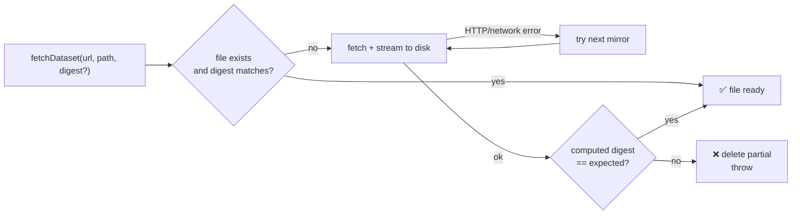

# Add `common/data_cache.ts` — fetch & cache datasets in hidden directories

## Summary

Adds a shared `fetchDataset` helper so future examples (MNIST, stock market, etc.) can pull
real-world data at runtime without bloating the repository. The helper downloads into a hidden
per-example directory, streams the response to disk, optionally verifies a SHA-256 digest, and falls
back to mirror URLs on HTTP or network failure. Documentation in `AGENTS.md` and `CONTRIBUTING.md`
now points contributors at the helper. Implementation uses only Deno's built-in `fetch` and
`crypto.subtle` — no new dependencies.

Closes #76.

## Evidence

- New unit tests in `common/data_cache_test.ts` cover the four "what" scenarios required by the
  issue plus a digest-cache-hit case:
  - happy path (download writes the served bytes)
  - cache hit (second call does not re-download — verified via request counter on a `Deno.serve`
    test server)
  - digest mismatch (call rejects, partial file removed)
  - mirror fallback (first URL 404s, second succeeds)
  - digest-validated cache hit (matching digest skips re-download)
- All five tests pass under
  `deno test --no-check --allow-read --allow-write --allow-env --allow-net`.
- `./quality.sh` passes — lint, fmt, type check, unit tests (324 total), and every example runner.

This is a CLI/library change with no UI surface, so no screenshots are attached.

## Test Plan

- [x] `common/data_cache_test.ts` — five Deno tests covering happy path, cache hit, digest mismatch,
      mirror fallback, and digest-validated cache hit.
- [x] `./quality.sh` passes locally (lint, fmt, type check, unit tests, every example runner).
