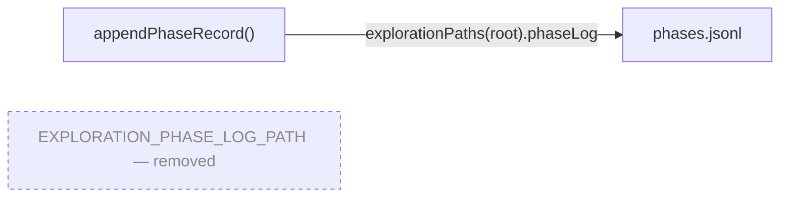

# Remove dead export `EXPLORATION_PHASE_LOG_PATH`

## Summary

Removed the unused exported constant `EXPLORATION_PHASE_LOG_PATH` (and its doc comment) from
`mnist_classification/exploration_campaign.ts`, and reworded the dangling `{@link}` on
`ExplorationPhaseRecord` to name `explorationPaths().phaseLog` instead. A repo-wide grep found
exactly two occurrences of the identifier — the declaration itself and that doc-comment link — with
no importer in any module (including every `_test.ts`), no barrel/`exports` entry in `deno.json`,
and no dynamic or string-keyed lookup in any `.sh`, `.md`, `.json`, `.yml` or `.js` file. The one
in-module consumer of the path already reads it via `explorationPaths(explorationRoot).phaseLog`,
which is unchanged. Closes #763.

## Evidence

Backend/library change only — no web interface to screenshot.

Dead-export verification before removal (declaration + doc link only):

```
$ grep -rn "EXPLORATION_PHASE_LOG_PATH" . --exclude-dir=.git
mnist_classification/exploration_campaign.ts:106:export const EXPLORATION_PHASE_LOG_PATH = explorationPaths().phaseLog;
mnist_classification/exploration_campaign.ts:412:/** One line in {@link EXPLORATION_PHASE_LOG_PATH}. */
```

The surviving path-resolution route after removal:



Quality gates:

- `deno fmt --check` — clean
- `deno lint` — clean
- `deno check mnist_classification/exploration_campaign.ts` — clean (no orphaned imports)
- `deno test mnist_classification/exploration_campaign_test.ts` — 10 passed, 0 failed
- `./quality.sh` — passes

## Test Plan

No test referenced the removed symbol, so no test was added, modified, or removed. Per AGENTS.md a
test asserting the absence of an export would be a forbidden "how" test; the real regression gate is
the compiler — `deno check` across the repo fails if any module imported the deleted constant. The
existing behavioural suite in `mnist_classification/exploration_campaign_test.ts` (10 "what" tests,
including `ExplorationPhaseRecord shape is JSON-serialisable`) continues to pass, confirming the
deletion did not disturb the surrounding module.
