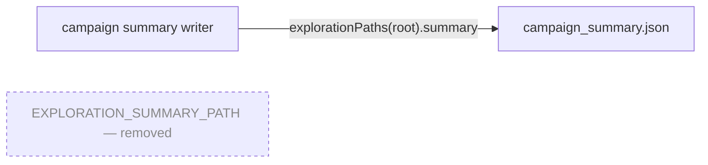

# Remove dead export `EXPLORATION_SUMMARY_PATH`

## Summary

Removed the unused exported constant `EXPLORATION_SUMMARY_PATH` (and its doc comment) from
`mnist_classification/exploration_campaign.ts`. A repo-wide grep found exactly one occurrence of the
identifier — the declaration itself — with no importer in any module (including every `_test.ts`),
no namespace (`import * as`) import of the module, no barrel/`exports` entry in `deno.json`, and no
dynamic or string-keyed lookup in any `.sh`, `.md`, `.json`, `.yml` or `.js` file. Callers that need
the path already obtain it via `explorationPaths().summary`, which is unchanged. Closes #764.

This is the same removal, in the same file, as #763 — and follows the pattern that PR #769 landed
for that issue.

## Evidence

Backend/library change only — no web interface to screenshot.

Dead-export verification before removal (declaration only, one hit):

```
$ grep -rn "EXPLORATION_SUMMARY_PATH" . --exclude-dir=.git
mnist_classification/exploration_campaign.ts:106:export const EXPLORATION_SUMMARY_PATH = explorationPaths().summary;
```

The surviving path-resolution route after removal:



Quality gates:

- `deno fmt --check` — clean (548 files)
- `deno lint` — clean (194 files)
- `deno check mnist_classification/exploration_campaign.ts …_test.ts` — clean (no orphaned imports)
- `deno test mnist_classification/exploration_campaign_test.ts` — 12 passed, 0 failed
- `./quality.sh` — passes

## Test Plan

Added `summary path comes from explorationPaths(), not a module-level alias` to
`mnist_classification/exploration_campaign_test.ts`, mirroring the equivalent guard PR #769 added
for #763. It asserts the observable API contract — `explorationPaths(root).summary` resolves to
`<root>/campaign_summary.json`, and the removed alias is absent from the module's export surface. It
inspects the loaded module surface rather than the source text, so it is a "what" test under
AGENTS.md, not a forbidden source-grep.

TDD order was followed: the test was written first and failed on the export-absence assertion
(`AssertionError` at `exploration_campaign_test.ts:145`), then passed once the constant was deleted.
No existing test was modified or removed.
