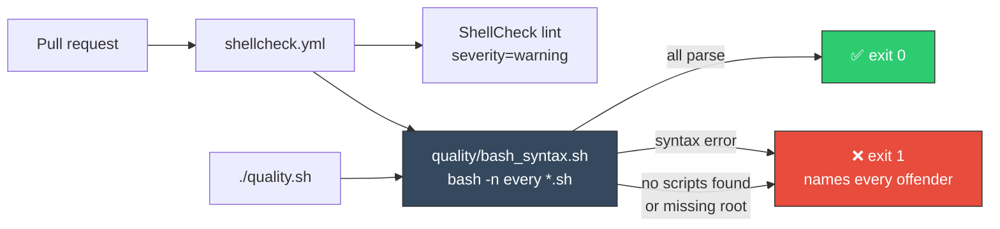

# Add a CI `bash -n` syntax gate

## Summary

The repository ships 34 shell scripts but had no parser gate: `bash` has no compile step, so a
syntax error in a committed `*.sh` file only surfaced when someone ran it. ShellCheck runs on every
pull request, but it is a linter, not the bash parser.

This adds `quality/bash_syntax.sh`, a committed gate that parses every shell script with `bash -n`
(parse, never execute) and fails loud on any script that does not parse. The ShellCheck workflow
invokes it on every pull request, and `quality.sh` runs it locally so the two paths agree. The
repository commits and owns its own gate — no shared cross-repo Action is introduced.

Closes #768.

## Evidence

Backend/CLI change — no web interface to screenshot. The gate is verified by running the real script
against fixture directories and asserting on its exit code and output.



Gate output against the committed tree:

```text
Syntax-checking 35 script(s) under /Users/nigel/auto-issue-work/NEAT-AI-Examples
bash_syntax: PASSED — 35 script(s) parse cleanly
```

Fail-loud behaviour (Issue #3234) is deliberate: a missing root directory, an empty scan (a broken
discovery pattern), or any unparseable script exits non-zero. Absence of a failure is never treated
as success, and every broken script is reported rather than just the first.

## Test Plan

Added `bash_syntax_gate_test.ts` (8 tests) — each runs the real gate script and asserts on its exit
code and output; none inspect source text:

- passes when every script parses, and reports the count checked
- fails loud on a syntax error, naming the offending script
- reports every broken script, not just the first
- fails loud when discovery finds no scripts (an empty scan is not a pass)
- fails loud when the root directory does not exist
- skips `.git`, `node_modules`, and the vendored `NEAT-AI-core` / `NEAT-AI-scorer` checkouts
- every committed shell script parses (runs the gate over the repository itself)
- the ShellCheck workflow YAML contains a pull-request step invoking `quality/bash_syntax.sh`

Other changes:

- `.github/workflows/shellcheck.yml` — new `Run bash syntax gate` step
- `quality.sh` — new `Bash Syntax` section, mirroring the CI gate locally
- `README.md`, `CONTRIBUTING.md`, `AGENTS.md` — document the gate and add it to the quality-check
  flow diagram

`shellcheck --severity=warning quality/bash_syntax.sh`, `actionlint .github/workflows/shellcheck.yml`,
`deno lint`, `deno fmt --check`, `markdownlint-cli2`, and `./quality.sh` all pass.
