# Add MNIST handwritten-digit classification example with animated grid SVG

## Summary

Adds a new `mnist_classification/` example that downloads a small MNIST subset, evolves a 196 → 10
LOGISTIC linear classifier with a per-class mean template warm-start, and renders an animated 5 × 4
grid SVG showing test predictions vs. ground truth (green ✓ / red ✗).

The example follows the established directory pattern (`data.ts`, `mnist_classification.ts`,
`svg.ts`, `_test.ts`, `run.sh`, `README.md`), is wired into `quality.sh` and the top-level README's
Examples table, gitGraph, and Screenshots section, and produces a committed
`docs/screenshots/mnist_classification.svg` snapshot.

Closes #77.

## Evidence

### End-to-end run

The runner completes well inside the CI 5-minute budget and crosses the 70 % held-out accuracy
threshold:

```
🔢 MNIST Handwritten-Digit Classification Example
📥 Fetching MNIST test-set IDX files (cached in .synthetic-mnist/data)…
   Parsed 10000 samples (28×28 pixels).
📊 Split: train=1000  val=200  test=200  (features=196, classes=10)

🧬 Evolving classifier…
   Gen   0  best=57.50%  mean=56.56%
   Gen  22  best=70.50%  mean=66.92%

✅ Solved after 23 generations (validation accuracy 70.50%).
💾 Saved champion to .synthetic-mnist/creatures/champion.json
📝 Wrote confusion matrix to .synthetic-mnist/output/confusion.json  (test accuracy 63.50%)
🖼️  Wrote screenshot docs/screenshots/mnist_classification.svg

🏁 Example completed in 5s 353ms
```

### Pipeline diagram

```mermaid
flowchart LR
    DL["📥 fetchDataset()<br/>MNIST IDX (pinned)"]
    DOWN["🔽 Down-sample<br/>28×28 → 14×14"]
    SPLIT["✂️ train / val / test<br/>contiguous slice"]
    INIT["🌱 Template warm-start<br/>per-class mean image"]
    EVOLVE["🧬 Truncation + mutation"]
    SCORE["📏 Accuracy on held-out fold"]
    CHAMP["💾 champion.json"]
    CONF["🧮 confusion.json"]
    GRID["🖼️ Animated 5×4 grid SVG<br/>green ✓ / red ✗"]

    DL --> DOWN --> SPLIT --> INIT --> EVOLVE --> SCORE
    SCORE -- not solved --> EVOLVE
    SCORE -- solved --> CHAMP --> CONF --> GRID
```



### Animated SVG snapshot

The committed
[`docs/screenshots/mnist_classification.svg`](docs/screenshots/mnist_classification.svg) is an
animated 5 × 4 grid. Each cell cross-fades through three held-out test digits over a 9-second SMIL
`<animate>` loop, rendered via per-pixel `<rect>` elements with a purple → teal → yellow intensity
ramp. The label below each cell shows `T:<true> P:<predicted>` in green for correct predictions and
red for misclassifications.

### Quality and test results

- `./quality.sh` — passes end-to-end (lint, fmt, type check, 390 unit tests, 9 example runners).
- `deno test mnist_classification/` — 31 new tests, all green.

### Decision: IDX over CSV

The issue text suggested a "stable public CSV mirror"; in practice the canonical IDX gzip pair
hosted by the Common Visual Data Foundation (`storage.googleapis.com/cvdf-datasets/mnist/`) is ~1.6
MB compared with ~18 MB for the equivalent CSV, and is the canonical primary distribution of MNIST.
Both files are SHA-256 pinned in `mnist_classification.ts`. The trade-off is documented in
[`mnist_classification/README.md`](mnist_classification/README.md).

## Test Plan

New tests in `mnist_classification/mnist_classification_test.ts` (31 tests):

- **IDX parsing** — magic-number validation, header decode, truncated-buffer rejection.
- **Down-sampling** — mean-pooling correctness; rejects non-multiple sizes.
- **Build samples / split** — contiguous slicing, edge cases (empty dataset, oversize split).
- **Network construction** — `buildInitialCreatureJSON` shape & validation; bias-count guard.
- **Genome round-trip & mutation** — gene encode/decode, mutation perturbs at least one gene.
- **Template warm-start** — per-class means produce a usable creature; predicts the seeded template
  label exactly with zero noise; rejects empty samples.
- **Predict / accuracy / confusion** — argmax behaviour, fractional accuracy, square confusion.
- **Evolve** — happy-path floor (≥ 50 % on synthetic stripe data); empty train and empty validation
  each raise a clear error; reproducibility with the same seed produces a byte-identical champion
  JSON.
- **Grid sample selection** — `pickGridSamples` spreads picks across all ten classes.
- **SVG renderer** — emits a well-formed animated SVG with both green and red colour codes; throws
  on an empty cell list.
- **Gzip helper** — round-trips a payload via `CompressionStream` → file → `readGzippedFile`;
  rejects missing files.

Existing structure tests (`readme_structure_test.ts`) were extended to cover the new example
directory and screenshot — these were updated to match the new acceptance criteria, not to mask
broken behaviour.

## Acceptance Criteria

- [x] `mnist_classification/` directory with `data.ts`, `mnist_classification.ts`, `svg.ts`,
      `mnist_classification_test.ts`, `run.sh`, and `README.md`.
- [x] `./mnist_classification/run.sh` completes in ~5 s on the local machine (well under the
      5-minute CI budget).
- [x] All unit tests pass (`deno test`, 390 tests green).
- [x] `docs/screenshots/mnist_classification.svg` is animated and shows predicted vs actual labels
      with green ✓ / red ✗ status.
- [x] `./quality.sh` passes end-to-end.
- [x] Top-level `README.md` lists the example in the Examples table and Screenshots section.
