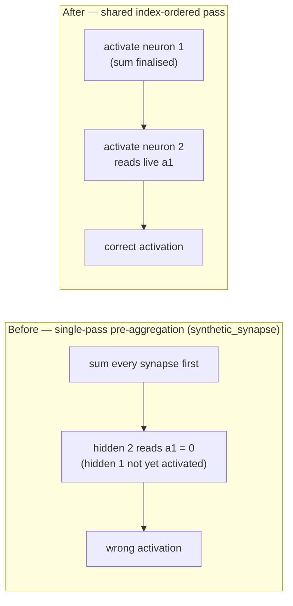
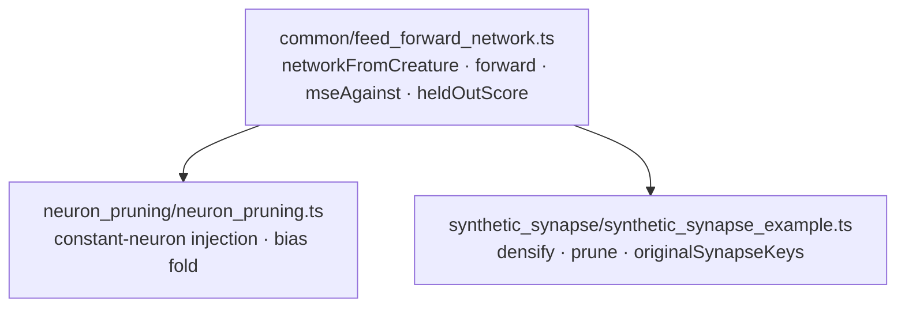

# 🟠 Reconcile the diverged forward-pass rule into `common/feed_forward_network.ts`

## Summary

The exported-`Creature` evaluation mini-framework (`networkFromCreature`, `forward`, `mseAgainst`,
`heldOutScore`) was copy-pasted between `neuron_pruning/neuron_pruning.ts` and
`synthetic_synapse/synthetic_synapse_example.ts`, and the two `forward` copies had **diverged**:
`neuron_pruning` activated neurons one at a time in index order, while `synthetic_synapse` still
pre-aggregated every synapse in a single pass — so a hidden→hidden synapse read its upstream
activation as a stale zero and silently produced wrong activations.

This PR reconciles the divergence on the correct (index-ordered) rule and extracts the shared core
into a new `common/feed_forward_network.ts` that both examples import. The synthetic-synapse demo's
own bookkeeping (`synthetic` synapse flag, `originalSynapseKeys`) stays caller-side, and
`networkFromCreature` unified cleanly via a single `onUnknownSquash: "throw" | "tanh"` option — the
neuron-pruning demo's two variants (strict for the target network, remap-to-TANH for the evolved
champion) are the two settings of that flag. Both examples keep their existing public exports
(`forward`, `heldOutScore`, `activate`, `networkFromCreature`, `Network`), so no caller changed;
`mseAgainst` stays private in the shared module exactly as it was in both copies.

Closes #775.

## Evidence

Backend/library change with no web interface — no screenshot applies. The evidence is the regression
test below, which fails against the unfixed `synthetic_synapse` copy and passes after the
extraction:

```text
$ deno test synthetic_synapse/synthetic_synapse_example_test.ts --filter cascade   # before the fix
forward - hidden→hidden cascade reads the upstream hidden activation ... FAILED
error: AssertionError: Expected actual: "3.997868672013283e-2" to be close to
       "5.79035181645869e-1": delta "5.390564949257362e-1" is greater than "1e-6".

$ deno test neuron_pruning/ synthetic_synapse/ common/feed_forward_network_test.ts  # after
ok | 53 passed | 0 failed (707ms)
```

Before and after, on a cascade `input 0 → hidden 1 → hidden 2 → output 3`:



Module layout after the extraction:



## Test Plan

New `common/feed_forward_network_test.ts` (10 tests):

- `activate` evaluates each supported squash, including the numerically stable negative-`z` logistic
  branch.
- `forward` on a hidden→hidden cascade matches the hand-computed activations and demonstrably
  differs from the pre-aggregated (wrong) value.
- `forward` passes inputs through their own squash and rejects a mismatched input length.
- `heldOutScore` (and through it the private `mseAgainst`) scores a perfect fit at zero, penalises a
  mismatch with the expected magnitude and sign, and returns zero for an empty dataset.
- `networkFromCreature` mirrors the `Creature` topology (arity, neuron types, finite non-input
  biases, forward-pass shape), throws on an unsupported squash by default, and remaps it to TANH
  when `onUnknownSquash: "tanh"` is passed.

Modified `synthetic_synapse/synthetic_synapse_example_test.ts`:

- Added `forward - hidden→hidden cascade reads the upstream hidden activation` — the regression test
  for this issue at the site that had the bug. No existing test was removed or weakened.

Existing `neuron_pruning` and `synthetic_synapse` suites pass unchanged against the shared
implementation, plus the full `./quality.sh` gate.
