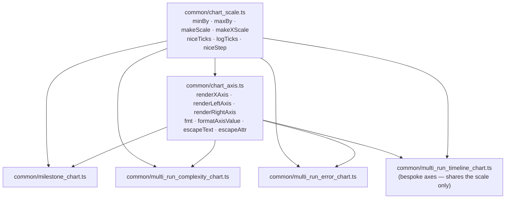

# 🟡 Extract the shared chart scale and tick maths into `common/chart_scale.ts`

## Summary

The chart-geometry rules — `makeScale`, `makeXScale`, `minBy` / `maxBy`, `niceTicks`, `logTicks` and
`niceStep` — were copy-pasted verbatim across `common/milestone_chart.ts`,
`common/multi_run_complexity_chart.ts` and `common/multi_run_error_chart.ts`, with a fourth
`makeScale` copy in `common/multi_run_timeline_chart.ts`. A change to any rule (supporting
generation 0 on the log axis, fixing the `v += step` float accumulation, adjusting the 1–2–5 step
table) had to land identically in three or four places.

This PR extracts that knowledge into two shared modules and rewires all four renderers:

- **`common/chart_scale.ts`** — the pure maths: extents, the linear scale (collapsing to the range
  centre on a degenerate domain), the log-X scale (clamped to 1 to avoid `log(0)`), and the three
  tick generators.
- **`common/chart_axis.ts`** — the axis renderers, which were also verbatim copies. `renderXAxis`,
  `renderLeftAxis` and `renderRightAxis` now take the axis label, the group class and the
  integer-tick mode as parameters — the three things that actually differed per caller — so no
  per-caller flag tangle was needed. The module also owns the deterministic coordinate/value
  formatting (`fmt`, `formatAxisValue`) and XML escaping (`escapeText`, `escapeAttr`) the axes and
  chart bodies share, which had one copy per renderer.

The two previously distinct value formatters (`formatScore`, `formatError`) were byte-for-byte
identical (round to three decimals) and collapsed into one `formatAxisValue`. Net effect: 707 lines
deleted from the four renderers against 331 lines of new shared module, with no behaviour change.

Closes #776.

## Evidence

Backend/library change with no web interface — no screenshot applies.

**Byte-identical output.** The refactor must not move a single pixel, so the four renderers were
driven over a 3021-line corpus of SVG output (log and linear X, caption on and off, degenerate
single-sample input, zero-valued count series, a 14-run multi-run series that trips the boundary
thinning policy, and a 3-run series that does not) before and after the change:

```text
$ deno run --config deno.json --allow-read /tmp/chart-baseline/gen.ts > before.txt   # pre-refactor
$ deno run --config deno.json --allow-read /tmp/chart-baseline/gen.ts > after.txt    # post-refactor
$ diff before.txt after.txt && echo IDENTICAL
IDENTICAL
```

**Tests.**

```text
$ deno test --allow-read common/chart_scale_test.ts
ok | 19 passed | 0 failed (23ms)

$ deno test --allow-read common/chart_axis_test.ts
ok | 12 passed | 0 failed (103ms)

$ deno test --allow-read --allow-write --allow-env --allow-net common/*chart*_test.ts
ok | 90 passed | 0 failed (890ms)
```

Module layout after the extraction:



`multi_run_timeline_chart.ts` keeps its own time/percentage axis renderers — they are genuinely
different (hour labels, `%` ticks, no log mode) — and now shares only `makeScale` and the escaping
helpers, removing its duplicate `makeScale`.

## Test Plan

- Added `common/chart_scale_test.ts` (19 cases): linear mapping and extrapolation, inverted SVG-y
  range, degenerate domain → range centre, log-mode decade spacing, the `log(0)` clamp for
  generation 0 and negative input, integer/continuous tick shape (whole, ascending, unique, upper
  bound always present, every tick inside the range), `logTicks` decade + bounds behaviour including
  a sub-1 lower bound and an inverted range, and the 1–2–5–10 `niceStep` progression with its
  non-positive fallback.
- Added `common/chart_axis_test.ts` (12 cases): X-axis tick placement at scaled positions, decade
  labelling and the `(log scale)` title suffix, XML escaping of a caller-supplied label, left/right
  axis tick and title geometry relative to the plot edge, caller-selected group class (`y-axis` for
  the error chart), integer tick labelling, degenerate single-tick range, and the `fmt` /
  `formatAxisValue` rounding plus their non-finite fallback.
- Existing `common/milestone_chart_test.ts`, `common/multi_run_complexity_chart_test.ts`,
  `common/multi_run_error_chart_test.ts` and `common/multi_run_timeline_chart_test.ts` are unchanged
  and still pass — they are the behavioural guard that the extraction preserved every renderer's
  contract.
- `./quality.sh`: Deno Format, Bash Syntax, Deno Lint, Deno Type Check, the full parallel unit suite
  and both MNIST integration suites all report SUCCESS. The examples stage re-renders the committed
  SVG artefacts, and the working tree stayed clean throughout it — an end-to-end confirmation that
  the extraction changed no rendered output.
