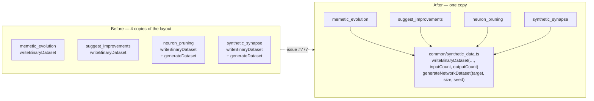

# 🟡 Extract the `evolveDir` `training.bin` binary layout (Issue #777)

## Summary

The `evolveDir` binary-record contract — inputs first, then targets, packed as consecutive
little-endian `Float32` values with a fixed per-record stride, written to `training.bin` inside the
example's data directory — was copy-pasted into four examples. It now lives in exactly one place.
Closes #777.

- **`common/synthetic_data.ts`** gains
  `writeBinaryDataset(dataset, dataDir, inputCount, outputCount)`, the single statement of the
  layout, and `generateNetworkDataset(targetNetwork, size, seed)`, the verbatim-identical dataset
  generator that `neuron_pruning` and `synthetic_synapse` each carried a copy of.
- **All four examples** — `memetic_evolution`, `suggest_improvements`, `neuron_pruning`,
  `synthetic_synapse` — keep their existing two-argument `writeBinaryDataset(dataset, dataDir)` as a
  one-line wrapper that supplies its own `INPUT_COUNT` / `OUTPUT_COUNT`. The two fixed-arity callers
  map their `{ inputs, output }` records to the shared `{ inputs, targets }` shape; the two
  network-driven callers pass their records straight through. No public surface changed, so every
  existing example test still exercises the same API.
- **Fail loud (new behaviour):** the shared writer rejects a record whose input or target arity does
  not match the declared stride, rather than silently shifting every later record. It also rejects a
  non-positive or non-integer `inputCount` / `outputCount`, and creates `dataDir` only after
  validation passes.

Behaviour is otherwise unchanged: the same bytes are written to the same path, and the four
examples' own tests (which round-trip the file and assert its byte count) pass untouched.

## Evidence

This is a backend/CLI refactor with no web interface to screenshot. The evidence is the test suite
plus the quality gate.

Where the rule lived before, and where it lives now:



Targeted run of the shared module plus all four affected example suites:

```text
$ deno test --no-check --allow-read --allow-write --allow-env --allow-net --allow-ffi \
    --allow-run="df,bash,git,deno" \
    common/synthetic_data_test.ts memetic_evolution/memetic_evolution_test.ts \
    suggest_improvements/suggest_improvements_test.ts neuron_pruning/neuron_pruning_test.ts \
    synthetic_synapse/synthetic_synapse_example_test.ts < /dev/null

ok | 119 passed | 0 failed (1s)
```

`deno lint` (201 files) and `deno fmt --check` (563 files) are clean.

`./quality.sh` surfaced one unrelated intermittent failure —
`lunar_lander/lunar_lander_test.ts::scoreController with perturbation varies the pad position across
trials`,
which builds an **unseeded** random creature and then asserts on the spread of the trials' final
`x`. It passes on re-run in isolation, and this change touches no `lunar_lander` code (that example
does not import `common/synthetic_data.ts` at all). Filed as
[#782](https://github.com/stSoftwareAU/NEAT-AI-Examples/issues/782).

## Test Plan

Eleven new "what" tests in `common/synthetic_data_test.ts`, all calling the real functions and
asserting on the bytes written or the values returned:

`writeBinaryDataset`

- `writes training.bin sized recordCount * stride * 4` — also asserts the returned path and that a
  not-yet-existing nested `dataDir` is created.
- `lays each record out as inputs then targets` — reads the file back through a `DataView` and
  checks every float against the source record at its expected little-endian offset.
- `accepts plain-array records from fixed-arity callers` — the shape `memetic_evolution` and
  `suggest_improvements` pass in.
- `writes an empty file for an empty dataset`.
- `rejects a record whose arity does not match the stride` — both a short input vector and a missing
  target, and asserts no file is left behind.
- `rejects non-positive input or output counts` — zero, and a non-integer.

`generateNetworkDataset`

- `returns the requested number of records` — with the arity taken from the network.
- `draws inputs from [-1, 1]`.
- `labels each record with the network's own output` — compares each target against a direct
  `forward(...)` call.
- `is deterministic for a given seed` — identical for the same seed, different for another.
- `rejects a non-positive size`.

Unmodified existing coverage that now exercises the shared code through the wrappers:
`memetic_evolution_test.ts`, `suggest_improvements_test.ts`, `neuron_pruning_test.ts` and
`synthetic_synapse_example_test.ts` each keep their byte-count round-trip test for
`writeBinaryDataset` and their `generateDataset` determinism tests.

## Documentation

- `AGENTS.md` — the `common/synthetic_data.ts` row now names both new helpers as the single home of
  the binary-record contract.
- `README.md` — the shared-utilities bullet for `synthetic_data.ts`.
- `docs/binary_training_stream.md` — a new "Examples that emit a single `training.bin`" section
  listing the four examples, their record shapes and working directories, and correcting the stale
  claim that `synthetic_synapse` does not emit a `.bin`.
