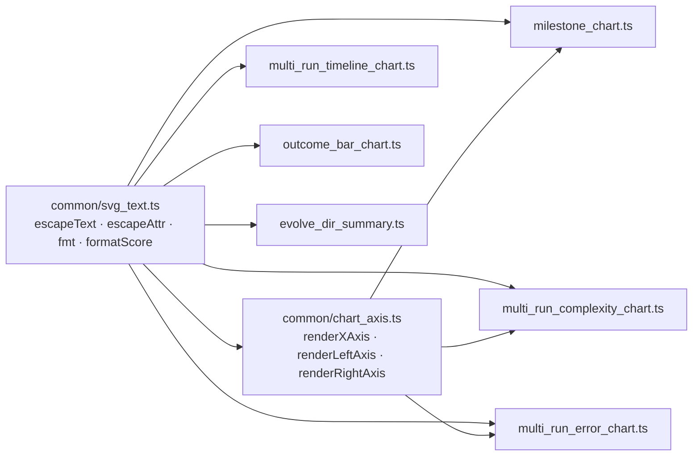

# PR Summary — Issue #778

## Summary

The SVG/XML escaping and deterministic number-formatting helpers were duplicated across the
SVG-emitting modules under `common/`. Two modules (`evolve_dir_summary.ts`, `outcome_bar_chart.ts`)
carried private copies of `escapeText` / `escapeAttr` / `fmt` / `formatScore`; the other four
(`milestone_chart.ts`, `multi_run_complexity_chart.ts`, `multi_run_error_chart.ts`,
`multi_run_timeline_chart.ts`) pulled the same functions from `chart_axis.ts`, where they had been
parked by [#776](https://github.com/stSoftwareAU/NEAT-AI-Examples/issues/776).

They now live once in a new **`common/svg_text.ts`**, exporting `escapeText`, `escapeAttr`, `fmt`
and `formatScore`. Every SVG emitter — plus `chart_axis.ts` itself — imports from there.
`chart_axis.ts`'s `formatAxisValue` was the same rule (three decimals, non-finite → `"0"`) under a
second name, so it folds into `formatScore` rather than surviving as a synonym. Module-specific
formatters with genuinely different rules (`formatRate` in `multi_run_error_chart.ts`,
`formatDuration` in `evolve_dir_summary.ts`) stay where they are — this is a lift of identical
functions, not a parameterised super-helper.

Net effect: −144 / +30 lines, and a change to either rule (escaping apostrophes, altering the
rounding precision, changing the non-finite fallback) now lands in one place.

Closes #778.

## Evidence

This is a backend/CLI refactor — there is no web interface to screenshot. Behaviour is verified by
tests plus a byte-identical output comparison against the pre-change tree.

### Dependency graph after the change



### Byte-identical output

The three renderers that lost private copies (`milestone_chart`, `outcome_bar_chart`,
`evolve_dir_summary`) were driven with fixture data whose titles contain `<`, `&` and `"`, before
and after the change (the pre-change tree checked out via `git worktree`). The concatenated output
is byte-identical:

```
13036 /tmp/before.svgtxt
13036 /tmp/after.svgtxt
BYTE-IDENTICAL
```

### Quality gate

```
deno fmt --check   → Checked 565 files
deno lint          → Checked 203 files
deno check         → Checked 51 files (common/)
deno test          → ok | 1364 passed (32 steps) | 0 failed (10m16s)
```

`./quality.sh`'s trailing example-runner section (24 full evolution runs) was **not** run to
completion locally — it exceeds the worker's time budget and regenerates committed
`docs/screenshots/*.svg` artefacts with per-run generation counts. The stages it runs before that
section (`deno fmt`, `bash_syntax.sh`, `deno lint`, `deno check`, the unit suite) were each run
directly and are green, as listed above; CI runs the full gate on this PR.

## Test Plan

- **Added** `common/svg_text_test.ts` — 7 "what" tests calling the real helpers:
  - `fmt` rounds to two decimals; non-finite (`Infinity`, `-Infinity`, `NaN`) degrades to `"0"`.
  - `formatScore` rounds to three decimals (including a negative value); non-finite degrades to
    `"0"`.
  - `escapeText` neutralises `&`, `<`, `>`, and handles the empty and metacharacter-free cases.
  - `escapeText` escapes `&` **before** the entities the later replacements introduce — the ordering
    rule the six copies all encoded (`escapeText("&amp;") === "&amp;amp;"`).
  - `escapeAttr` layers `"` → `&quot;` on top of `escapeText`.
- **Relocated** the `fmt` / `formatAxisValue` / `escapeText` / `escapeAttr` cases out of
  `common/chart_axis_test.ts` into `common/svg_text_test.ts`, alongside the code they exercise. No
  coverage was dropped — the relocated assertions are a subset of the new file's cases, with
  `formatAxisValue` renamed to `formatScore`.
- **Unchanged and still passing**: the existing renderer suites (`milestone_chart_test.ts`,
  `multi_run_complexity_chart_test.ts`, `multi_run_error_chart_test.ts`,
  `multi_run_timeline_chart_test.ts`, `outcome_bar_chart_test.ts`, `evolve_dir_summary_test.ts`,
  `chart_axis_test.ts`) — these are the regression guard that the substitution changed no output.

## Documentation

`AGENTS.md` — added the `common/svg_text.ts` row to the shared-helpers table and the file-tree
listing, and narrowed the `common/chart_axis.ts` description to the axis renderers it still owns.
