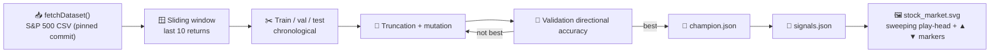

# Stock Market Direction Prediction Example

## Summary

Adds a new `stock_market/` example that evolves a tiny NEAT-AI network to predict next-period
direction (up/down) on the public S&P 500 monthly-close dataset, then renders an animated SVG of the
test window with four-colour ▲/▼ markers showing prediction-vs-outcome at each bar. The example
mirrors the conventions of `cart_pole/` and `lunar_lander/`: a single-file evolutionary loop, a
`svg.ts` renderer, "what" tests, a `run.sh`, and a per-example `README.md`. Wired into `quality.sh`,
the top-level README, and the structure tests so it runs end-to-end on every CI build.

Closes #78.

## Evidence

End-to-end run completes in under 1 second on a developer laptop and produces:

- `.synthetic-stock/data/prices.csv` — cached dataset (1865 monthly closes, 1871-01 → 2026-05)
- `.synthetic-stock/creatures/champion.json` — fittest controller
- `.synthetic-stock/output/signals.json` — per-day prediction vs. outcome on the test window
- `docs/screenshots/stock_market.svg` — animated chart with SMIL-driven sweeping play-head

```text
📈 Stock-Market Direction Prediction Example
📥 Fetching dataset (cached in .synthetic-stock/data/prices.csv)…
   Loaded 1865 price points (1871-01-01 → 2026-05-01).
🪟 Building sliding-window samples (window=10)…
   Train=1297  Val=278  Test=279
🧬 Evolving controller…
   Gen   0  best=61.15%  mean=50.25%
   Gen  29  best=66.55%  mean=61.11%
📏 Validation directional accuracy: 66.55%
📈 Test accuracy: 67.74%   cumulative strategy return: 269.80%
🏁 Example completed in 851ms
```

`./quality.sh` passes end-to-end:

```text
SUCCESS: Deno Lint / Format Check / Type Check / Unit Tests
SUCCESS: Intelligent Design / Discovery / Crossover / Cart-Pole / Lunar Lander / XOR
SUCCESS: Stock Market Direction Prediction Example
SUCCESS: Suggest Improvements
All examples passed!
```

### Architecture



The dataset URL is pinned to a specific upstream commit (`45117dfc620664bda935a7dbd692f65a5beaa1cd`)
and verified against a SHA-256 digest by `common/data_cache.ts`, so runs are reproducible across
machines and CI.

## Test Plan

New tests under `stock_market/`:

- `data_test.ts` — CSV parsing, return computation, sliding-window construction (with a structural
  no-look-ahead assertion on a synthetic monotone series), and chronological split correctness.
- `stock_market_test.ts` — "what" tests covering:
  - **Happy path**: champion validation accuracy beats the documented 50% floor on a deterministic
    synthetic series.
  - **Edge case**: `buildSamples` raises a clear error when given fewer rows than the window size.
  - **No look-ahead**: features for day `t` only use returns from days strictly earlier than `t`.
  - Genome shape, gene round-trip, deterministic random initialisation, mutation validity,
    directional-accuracy calculation, replay record shape, cumulative-strategy-return arithmetic,
    glyph classification, and SVG structure (animated, multiple colours, captions, disclaimer).

Existing structural tests updated to know about the new example:

- `readme_structure_test.ts` — added `stock_market` to `EXAMPLE_DIRS`, the screenshot list, and the
  required example-name list.
- `docs/archive_test.ts` — allowlisted `pr-summary-78.md` (this PR) and `pr-summary-76.md` (the
  pre-existing dependency PR).

Acceptance criteria status:

- [x] `stock_market/` directory exists with `stock_market.ts`, `stock_market_test.ts`, `svg.ts`,
      `run.sh`, and `README.md` (plus `data.ts` / `data_test.ts` for the CSV/window helpers).
- [x] `./stock_market/run.sh` completes in under 5 minutes on CI (≈1 s locally).
- [x] All unit tests pass.
- [x] `docs/screenshots/stock_market.svg` is animated (SMIL `<animate>`) and shows
      prediction-vs-outcome markers in four distinct colours.
- [x] `./quality.sh` passes end-to-end.
- [x] Top-level `README.md` lists the example in the Examples table and Screenshots section.
- [x] README explicitly notes this is a teaching example, not investment advice.
