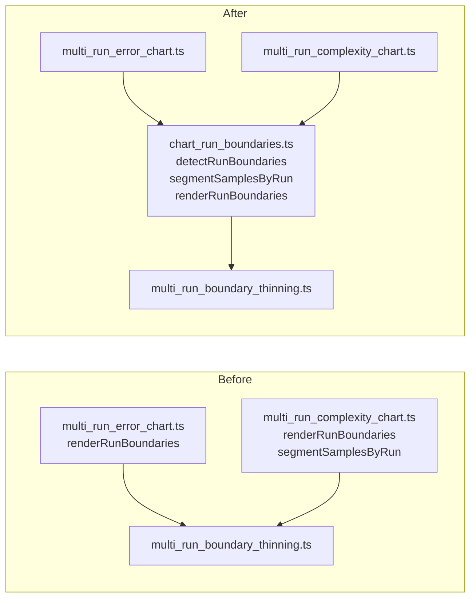

# Extract shared run-boundary handling into `common/chart_run_boundaries.ts` (Issue #780)

## Summary

`renderRunBoundaries` was byte-for-byte identical in `common/multi_run_complexity_chart.ts` and
`common/multi_run_error_chart.ts`, and `segmentSamplesByRun` — the same shared knowledge for the
other renderer — lived only in the complexity chart. Both now live once in a new sibling of the
`#776` chart module family, `common/chart_run_boundaries.ts`, which exports:

- `detectRunBoundaries(samples)` — walks the milestones in cumulative order and de-duplicates every
  `runIndex` transition to one `(runIndex, cumulativeGen)` pair.
- `segmentSamplesByRun(samples)` — splits milestones into contiguous runs so polylines do not draw
  vertical connectors across a run boundary. Generic over the sample type, so the caller's extra
  fields (neurons, synapses, …) carry through.
- `renderRunBoundaries({ samples, xScale, plotTop, plotH, plotW })` — emits the
  `<g class="run-boundaries">` fragment, keeping only the boundaries the thinning policy selects.

The boundary *policy* stays where it was, in `common/multi_run_boundary_thinning.ts`; this change
moves only the detection, segmentation and emission around it. Both renderers now import from the
shared module and their local copies (plus the duplicated `BOUNDARY_COLOUR` constant) are gone —
135 lines deleted against 24 added across the two charts.

Closes #780.

## Evidence

This is a backend/CLI change with no web interface to screenshot. The acceptance criterion was
output preservation, verified by diffing rendered SVG before and after the refactor.



**Byte-identical SVG check.** Both renderers were run over five multi-run series before and after
the change — 4 runs (3 boundaries, ≤10 path) and 25 runs (24 boundaries, thinned path), each on
both log and linear X, plus a single-run series with no boundaries — with captions on. `diff` and
`cmp` both report the concatenated output identical:

```text
$ diff /tmp/svg_before_780.txt /tmp/svg_after_780.txt && cmp ... && echo OK
BYTE-IDENTICAL
cmp OK
```

The repository's own pre-#521 baseline snapshots
(`common/testdata/baseline_err_10runs.svg`, `baseline_cx_10runs.svg`) still match — those two
snapshot tests pass unchanged.

## Test Plan

- Added `common/chart_run_boundaries_test.ts` (10 cases), each calling a real function and
  asserting on the returned value or emitted SVG structure:
  - `detectRunBoundaries` — one boundary per transition; none for a single run or an empty series;
    de-duplication when several samples share the transition generation.
  - `segmentSamplesByRun` — contiguous runs in order; single-run and empty inputs; caller's extra
    sample fields preserved.
  - `renderRunBoundaries` — a guide line spanning the plot height plus a `run N` label per
    boundary at the scaled X; an empty `run-boundaries` group when there are no transitions; all
    ten labels kept at ten boundaries; thinning past ten with both anchors surviving and ticks
    never emitted without a label.
- Existing `common/multi_run_error_chart_test.ts`, `common/multi_run_complexity_chart_test.ts`,
  `common/multi_run_boundary_thinning_test.ts`, `common/chart_axis_test.ts`,
  `common/milestone_chart_test.ts` and `common/multi_run_timeline_chart_test.ts` pass unmodified
  (81 tests), including the two byte-identical baseline snapshot tests.
- `./quality.sh` run clean.

## Documentation

- `AGENTS.md` — added `common/chart_run_boundaries.ts` to the `common/` module table and the
  directory tree.
- `common/multi_run_boundary_thinning.ts` — header now points at the shared emitter that routes
  through the policy, rather than naming the two renderers directly.
