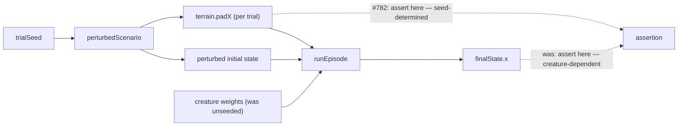

# Flaky lunar_lander pad-variation test pinned to the scorer's own terrain (Issue #782)

## Summary

The lunar_lander test `scoreController with perturbation varies the pad position across trials`
built its controller with an **unseeded** `new Creature(INPUT_COUNT, OUTPUT_COUNT)` and then
asserted that the 20 trials spanned more than 5 m of final-state `x`. That spread is emergent
behaviour of whatever random weights the draw produced, so a controller that happened to fly a
narrow trajectory failed the assertion — a span of only ~2.4 m was observed on a branch that touched
no lunar_lander code.

The fix moves the assertion onto the thing issue #253 actually promises: the pad centres
`scoreController` sampled. `TrialResult` now carries the `terrain` each trial was flown and scored
against, so the test reads the per-trial `padX` values directly instead of inferring terrain
variation from the trajectory. Those draws depend only on `trialSeed`, making the assertion
deterministic for every controller. The controller is also built from a fixed seed via
`makeCreatureExport`, removing the unseeded randomness entirely.

Closes #782.

## Evidence

Backend/CLI change — no web interface to screenshot. Evidence is the test run.

The flakiness came from asserting on the far end of the chain; the fix asserts at the source:



Targeted run after the change:

```
scoreController returns a finite score and a recognised outcome ... ok (15ms)
scoreController with multiple perturbed trials returns the mean and is deterministic ... ok (21ms)
scoreController with perturbation varies the pad position across trials (issue #253) ... ok (24ms)
scoreController reports the terrain each trial was scored against (issue #782) ... ok (3ms)

ok | 4 passed | 0 failed | 71 filtered out (140ms)
```

Before the production change the new assertions failed to type-check
(`Property 'terrain' does not exist on type 'TrialResult'`), confirming the tests exercise the new
behaviour rather than passing vacuously.

## Test Plan

- Modified
  `lunar_lander/lunar_lander_test.ts::scoreController with perturbation varies the pad
  position across trials (issue #253)`
  — now builds the creature from `makeCreatureExport({ input, output, hidden: 3, seed: 782 })` and
  asserts that the per-trial `terrain.padX` values span more than `WIDE_RANGES.padX` and are all
  distinct. No existing coverage was removed: the test still pins that `perturbedScenario` varies
  the pad across trials, and pins it more directly.
- Added
  `lunar_lander/lunar_lander_test.ts::scoreController reports the terrain each trial was
  scored against (issue #782)`
  — covers the single-trial default path and the unperturbed multi-trial path, both of which must
  report `DEFAULT_TERRAIN`.
- `./quality.sh` passes.
