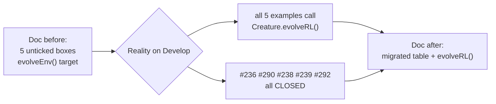

# PR Summary — Issue #787

## Summary

`docs/event-driven-evolution.md` still presented the five reinforcement-example migrations as
pending — an all-unticked scoreboard, "will migrate one-by-one as the upstream API stabilises", and
"when every box is ticked … the per-example hand-rolled evolution loops can be retired" — and named
the migration target `evolveEnv()` throughout. All five migrations shipped long ago and every
example calls `Creature.evolveRL()`. The doc now records the completed state and names the API the
code actually calls. Closes #787.

What changed in `docs/event-driven-evolution.md`:

- **Migration status** rewritten from an unticked checkbox list to a one-line "all five migrated"
  statement plus a table linking each example to its closed migration issue (#236, #290 superseding
  #237, #238, #239, #292 superseding #240). The "will migrate one-by-one" and "when every box is
  ticked" prose is gone.
- **API naming** switched from `evolveEnv()` to `evolveRL()` in the navigation blurb, the paradigm
  table, the Mermaid diagram, the "why the split matters" section, and the telemetry note.
- **`evolveRL()` vs `evolveEnv()`** stated once: upstream `Creature` exposes both; `evolveRL()`
  takes the class-shaped `EpisodeAdapter` and is what every example here calls, `evolveEnv()` is the
  earlier sibling taking the object-shaped `LegacyEpisodeAdapter`. The upstream doc is linked for
  the details rather than restating them.
- **Telemetry note** corrected to say milestones are collected under `statistics: true` and returned
  as `milestones` on the run summary.

A `CHANGELOG.md` entry was added under `### Documented` per the CONTRIBUTING PR checklist.

## Evidence

Doc-only change — no web interface to screenshot. The verification is the new test file, which
cross-checks the doc against the real dependency and against the closed migration issues.

Ground truth confirming the doc was stale (all five call `evolveRL`, not `evolveEnv`):

```
cart_pole/cart_pole.ts:582:            const result = await seedCreature.evolveRL(adapter, evolveOptions);
mountain_car/mountain_car.ts:595:      const result = await seedCreature.evolveRL(adapter, evolveOptions);
snake_game/snake_game.ts:644:         const result = await seedCreature.evolveRL(adapter, evolveOptions);
maze_navigation/maze_navigation.ts:439: const result = await seedCreature.evolveRL(adapter, evolveOptions);
lunar_lander/lunar_lander.ts:1021:     const result = await seedCreature.evolveRL(adapter, evolveOptions);
```

All five migration issues are `CLOSED` (`gh issue view`): #236, #237 (superseded by #290), #238,
#239, #240 (superseded by #292).



## Test Plan

Added `docs/event_driven_evolution_test.ts` (6 tests, all failing against the old doc except the
existence and upstream-link checks):

- `event-driven doc exists`
- `event-driven doc names the API the dependency actually exposes` — asserts
  `Creature.prototype.evolveRL` and `evolveEnv` are both functions on the real `@stsoftware/neat-ai`
  dependency, and that the doc names both. This pins the doc's API claims to the live library, not
  to prose.
- `paradigm table names evolveRL() for every reinforcement example` — each of the five
  paradigm-table rows must name `evolveRL()` and must not name `evolveEnv()`.
- `migration status records every reinforcement example as migrated` — the migration-status section
  must contain no unticked checkbox and must cite each example and its closed migration issue.
- `event-driven doc carries no pending-migration prose` — rejects "will migrate one-by-one", "when
  every box is ticked", "tick a box when", "can be retired".
- `event-driven doc links the upstream API spec`.

Verified before the doc rewrite: 4 of 6 failed. After the rewrite: 6 passed. `./quality.sh` run
clean.
