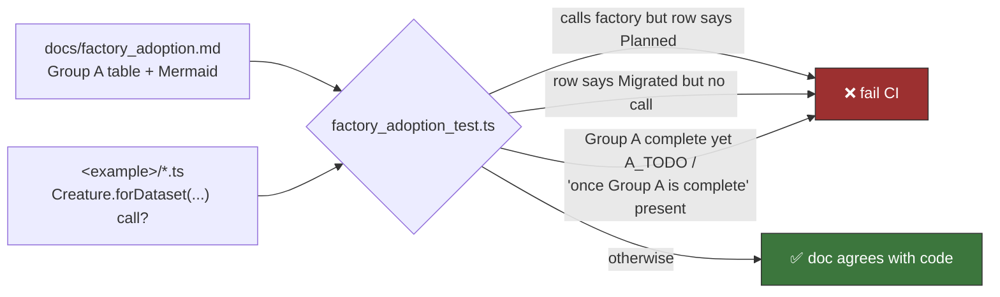

# PR Summary — Issue #788

## Summary

`docs/factory_adoption.md` — the canonical decision record for factory-adoption tracker #517 — still
listed `evolution_showcase` as "🟡 Planned" even though #534 shipped (closed 2026-06-02) and
`evolution_showcase/evolution_showcase.ts:319` seeds from `Creature.forDataset(records, options)`.
The adoption-flow diagram routed the example to `A_TODO`, and both the Group B and Group C summaries
deferred their migrations "once Group A is complete", so the doc contradicted `AGENTS.md:160-168`,
which already documents the same migration as a landed factory-adoption exception.

Changed:

- Group A row for `evolution_showcase` → ✅ Migrated, citing #534 and describing the actual seed
  (`cost: "MSE"` → `IDENTITY` output, target-mean bias warm-start, factory hidden layer, bare
  baseline retained as `buildRandomSeedCreature`).
- Adoption-flow Mermaid: `A_TODO` removed, `evolution_showcase` folded into `A_DONE`, which now
  reads "✅ Group A complete".
- Group B and Group C summaries reworded — Group A is complete, and those migrations are named as
  the open remainder. No follow-up issues exist for them yet, and the doc says so rather than citing
  invented issue numbers.
- A "Status as at 2026-08-11" callout at the top so the next drift is visible at a glance.
- `CHANGELOG.md` entry under **Documented**, matching the #787 precedent.

Closes #788.

## Evidence

Documentation-only change — no web interface to screenshot. The verification is the new test, which
fails against the pre-fix doc and passes after it:

```text
# before the doc fix
factory_adoption.md carries a status-as-at date so drift stays visible ... FAILED
Group A table lists every factory-seeded example as Migrated ... FAILED
  → evolution_showcase seeds from Creature.forDataset(...) but
    docs/factory_adoption.md lists it as "🟡 Planned"
FAILED | 3 passed | 2 failed

# after
ok | 5 passed | 0 failed
```

The test does not hardcode `evolution_showcase`. It parses the Group A table and cross-checks every
row against whether that example's own sources really call `Creature.forDataset(...)`, so the
invariant holds for any example added to the table later.



Full gate results: `deno fmt --check` (575 files), `deno lint` (208 files), `quality/bash_syntax.sh`
(35 scripts), `deno check` on the new test, and the parallel unit suite — **1389 passed, 0 failed**.
The example-execution sections of `quality.sh` are untouched by a docs-and-test change.

## Test Plan

Added `docs/factory_adoption_test.ts` (5 tests, all asserting on the published doc against the
example sources):

- `factory_adoption.md carries a status-as-at date so drift stays visible`
- `Group A table lists every factory-seeded example as Migrated` — the regression test for this
  issue; fails against the unfixed doc.
- `Group A table only claims Migrated for examples that seed from the factory` — guards the opposite
  drift, a row ticked before the code lands.
- `Adoption-flow diagram does not route migrated examples to the TODO node`
- `Completed Group A is not charted or worded as outstanding` — bites if `A_TODO` or "once Group A
  is complete" reappears while every Group A row is migrated.

No existing tests were modified or removed.
