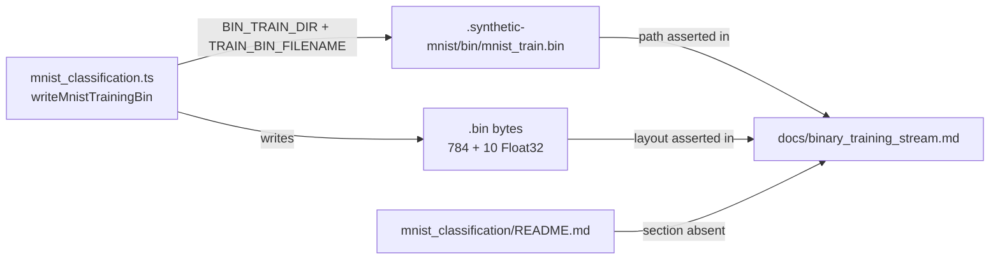

# Correct the MNIST classification in `docs/binary_training_stream.md`

## Summary

`docs/binary_training_stream.md` listed `mnist_classification` under "examples that do not currently
emit a `.bin` file themselves" and cited a `mnist_classification/README.md` section — "Where NEAT-AI
is faster than this demo suggests" — that no longer exists. Both claims are false: the runner
encodes all 60 000 training records into `.synthetic-mnist/bin/mnist_train.bin` via
`writeMnistTrainingBin(...)` (`mnist_classification/mnist_classification.ts:552`, called at line
1079), and the README states exactly that at lines 283 and 347.

Changes:

- Added a **"The MNIST example emits a `.bin` from real data"** table listing the writer
  (`writeMnistTrainingBin(samples, outPath)` — the IDX → `.bin` encoder) and the working directory
  (`.synthetic-mnist/bin/mnist_train.bin`), plus the 784 + 10 record shape.
- Deleted the "Related examples that discuss the `.bin` stream" section — its only entry was the
  false MNIST claim and the dead README reference. The trailing note about `synthetic_synapse` went
  with it; that example is already covered by the `training.bin` table.
- Corrected two supporting statements that assumed XOR was the only example with its own writer (the
  wire-format note and step 2 of the pipeline reading direction).
- Linked the MNIST writer from **See also**.

Closes #789.

## Evidence

Backend/docs change — no web interface to screenshot. The verification is the new test file, which
checks the doc against the code it describes rather than against itself:



The first test calls the real writer and asserts the emitted bytes are exactly
`records × (784 + 10) × 4` with inputs followed by a one-hot target — that is the fact the doc's old
classification contradicted. The path assertion is derived from the exported `BIN_TRAIN_DIR` /
`TRAIN_BIN_FILENAME` constants, so moving the file breaks the test rather than silently rotting the
doc. The dead-reference test asserts against the README's current text, so it self-corrects if the
section is ever reinstated.

Test run:

```
running 6 tests from ./docs/binary_training_stream_test.ts
binary stream doc exists ... ok
mnist_classification really emits a .bin file in the documented layout ... ok
doc lists mnist_classification as an emitting example with its real path ... ok
doc does not claim mnist_classification skips the .bin stream ... ok
doc cites no README section that no longer exists ... ok
every example the doc lists as emitting a .bin cites a working-directory path ... ok

ok | 6 passed | 0 failed
```

Before the doc edit, the four content tests failed (the writer test passed, confirming the doc — not
the code — was wrong).

## Test Plan

New file `docs/binary_training_stream_test.ts`, following the existing
`docs/event_driven_evolution_test.ts` doc-consistency pattern:

- `mnist_classification really emits a .bin file in the documented layout` — calls
  `writeMnistTrainingBin` on synthetic samples and asserts the file size, input ordering, and
  one-hot targets match the wire format the doc specifies.
- `doc lists mnist_classification as an emitting example with its real path` — every table row
  naming the example must cite the constant-derived path and its writer.
- `doc does not claim mnist_classification skips the .bin stream` — regression guard on the removed
  "do not currently emit" / "deliberately leaves out" prose.
- `doc cites no README section that no longer exists` — cross-checks the removed README heading
  against both files.
- `every example the doc lists as emitting a .bin cites a working-directory path` — every row in the
  three emitting tables carries a hidden working-directory `.bin` path.
- `binary stream doc exists` — the doc is present.

No existing tests were modified or removed.
