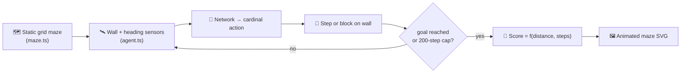

# Maze Navigation Example

## Summary

Adds a new `maze_navigation/` example that evolves a NEAT-AI agent to navigate a fixed 12×12 grid
maze from a start cell to a goal cell using local sensor inputs (four wall distances plus a packed
heading-to-goal). The example mirrors the structure of `snake_game/`: a pure-TypeScript simulator
(`maze.ts`), a sensor/action module (`agent.ts`), an evolutionary loop with truncation selection
(`maze_navigation.ts`), and an animated SVG renderer (`svg.ts`) that traces the agent's footsteps
through the maze with a dotted breadcrumb polyline and a pulsing goal cell. Closes #79.

## Evidence

The example is a CLI / SVG-rendering task with no web interface — evidence is the deterministic
champion run plus the unit tests.



Champion run output (deterministic seed `42`, 80-creature population, 60 generations):

```
✅ Champion reached the goal in 18 steps (final distance 0, score=0.982, generations=60).
```

The agent solves the L-shaped corridor in the optimal 18 steps (9 east + 9 south).

`./quality.sh` passes end-to-end including the new `maze_navigation` example, all 39 maze-navigation
unit tests, and the README structure / mermaid / archive tests.

The animated SVG embedded in the top README is committed at `docs/screenshots/maze_navigation.svg`.

## Test Plan

- New unit tests in `maze_navigation/maze_test.ts` (17 tests) cover:
  - Parsing string-art layouts (happy path + rejecting malformed layouts).
  - Bounds, wall, and Manhattan helpers.
  - Step semantics: happy path, walls block, `Stay` no-op, frozen-once-reached.
  - **Walls block movement** — moving into a wall leaves the agent's position unchanged.
  - **Sensor reading** — at a known cell the four wall distances match a hand-computed table.
  - `wallDistance` cap behaviour.
- New unit tests in `maze_navigation/agent_test.ts` (7 tests) cover sensor encoding, heading-to-goal
  unit vector, argmax decoding, and the rule that `Stay` is never emitted.
- New unit tests in `maze_navigation/maze_navigation_test.ts` (15 tests) cover creature
  construction, gene round-tripping, mutation, scoring, evolution, replay, SVG rendering, and
  **reproducibility** (fixed seed → byte-identical champions).
- Updated `readme_structure_test.ts` to include `maze_navigation` in `EXAMPLE_DIRS`,
  `SCREENSHOT_PATHS`, and the required-name list — all existing structural tests continue to pass.
- Wired the example into `quality.sh` (added `run_example` line and `.synthetic-maze` cleanup); the
  full pipeline (`./quality.sh`) passes.
- Updated `docs/archive_test.ts` allowlist to include `pr-summary-79.md` (this PR) and
  `pr-summary-81.md` (a pre-existing miss from PR #81 that was breaking the test).
