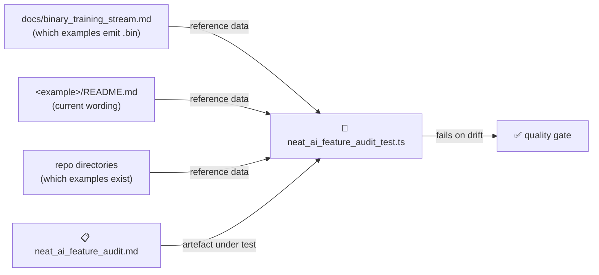

# PR Summary — Issue #790

## Summary

`docs/neat_ai_feature_audit.md` is the file `README.md` declares the source of truth for which
capability each example demonstrates, but its central table and register had drifted behind the
repository. This refreshes the audit and adds the tests that keep it honest. Closes #790.

- **Binary `.bin` Training Stream** row said "not yet demonstrated … no example exhibits it". It now
  names the twelve emitting examples and cites `docs/binary_training_stream.md`
  ([#190](https://github.com/stSoftwareAU/NEAT-AI-Examples/issues/190), PR #226). The matching
  "reporter point 2" paragraph is marked resolved for the same reason.
- **MNIST and synthetic-synapse rows** still flagged wording (`"SGD beats NEAT"`, the `"Pure NEAT"`
  column heading) that no longer exists anywhere in those READMEs. Those rows are now **✅
  Resolved** with the superseded wording struck through and the fixing issues/PRs linked (#185 → PR
  #194, #188 → PR #225).
- **Register completeness** — the register claimed to list every `<example>/README.md` but omitted
  `tsp_constructive` and `tsp_two_opt`. Both are added.
- **Honest framing** — the status block now dates the verdicts ("verified as at 2026-08-11") and
  separates the two kinds of content: verdicts and the register are live and test-enforced;
  un-struck quoted passages are #184-era snapshots that later rewrites may have reworded. The
  `README.md` pointer says the same, so the file is no longer presented as uniformly current.

**Regression found, not fixed here (out of scope):** the science-driven Discovery framing added by
#189 (PR #197) — and its enforcing test — were dropped by the later #207 / #208 README rewrites, so
the audit's "framing absent" verdicts for `discovery/` and `discovery_at_scale/` are accurate again.
That is a separate root cause; filed as
[#797](https://github.com/stSoftwareAU/NEAT-AI-Examples/issues/797) and cross-linked from the audit.

## Evidence

Documentation-only change plus its "what" tests — no UI or runtime behaviour, so nothing to
screenshot. The verification path is `docs/neat_ai_feature_audit_test.ts`, which reads the published
audit from disk and cross-checks it against the repository. All six cases fail against the audit as
it stood before this change:

```text
register lists every example README in the repository ...
  AssertionError: tsp_constructive/README.md exists but the per-README register ... does not list it
binary .bin capability row is not marked undemonstrated ...
  AssertionError: docs/binary_training_stream.md tables 12 examples emitting a .bin, but
  docs/neat_ai_feature_audit.md still records the capability as undemonstrated
rows accusing a README of misleading wording quote wording it still contains ...
  AssertionError: flags mnist_classification/README.md over wording none of them still contain:
  "SGD beats NEAT by orders of magnitude in wall-clock" ...
audit records the date its verdicts were last verified ... FAILED
superseded quotes really are gone from the README they are struck through for ... FAILED
```

After the refresh:

```text
deno test --allow-read --allow-write --allow-env --no-check docs/
ok | 28 passed | 0 failed
```

Full gate: `deno fmt --check` (579 files), `deno lint` (210 files), `deno check ./**/*.ts`, and the
parallel unit suite — `ok | 1401 passed (32 steps) | 0 failed (10m3s)` — all clean. The example-run
sections of `quality.sh` were not re-run; this change touches no example source.



## Test Plan

New file `docs/neat_ai_feature_audit_test.ts` — six `Deno.test` cases, all reading real files and
asserting on their content (no source-grepping of implementation):

- `audit records the date its verdicts were last verified` — the status block must carry an
  `as at YYYY-MM-DD` date.
- `register lists every example README in the repository` — enumerates every root directory holding
  a `README.md` and requires a register row for each (regression test for the missing TSP entries).
- `register only lists READMEs that exist` — the reverse direction, catching a stale or mistyped
  register path.
- `binary .bin capability row is not marked undemonstrated` — parses the emitting examples out of
  `docs/binary_training_stream.md` and fails if the audit still calls the capability undemonstrated
  or names none of them.
- `rows accusing a README of misleading wording quote wording it still contains` — any unresolved
  row that calls a README misleading must quote wording that README still has.
- `superseded quotes really are gone from the README they are struck through for` — a row may only
  strike wording through as superseded when the README genuinely no longer contains it.
