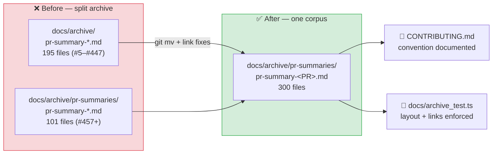

## Summary

The PR-summary archive was split across two undocumented locations: 195 summaries sat loose as
`docs/archive/pr-summary-*.md` (PRs #5–#447) while 101 lived under
`docs/archive/pr-summaries/pr-summary-*.md` (#457 onward), so any glob over either path silently
missed most of the corpus. This PR consolidates the archive into one location, repairs the relative
links the move broke, and writes the convention down so the seam cannot re-open. Closes #792.

- `git mv` of all 195 loose files into `docs/archive/pr-summaries/` — a pure rename, no summary
  content rewritten and no learnings lost. The directory now holds 300 summaries.
- Fixed 16 relative links across 7 moved summaries. Most were already broken by the earlier
  `docs/` → `docs/archive/` move (e.g. `../AGENTS.md` resolved to `docs/AGENTS.md`); they now use
  the same depth as the existing subdirectory summaries — `../../../` for the repository root and
  `../../screenshots/` for `docs/screenshots/`. A quoted link inside a code span in
  `pr-summary-72.md` was deliberately left as-is: it quotes README text, not a live link.
- `CONTRIBUTING.md` gains a **📚 PR Summaries** section naming
  `docs/archive/pr-summaries/pr-summary-<PR>.md` as the canonical path, plus a PR-checklist item.
- `CHANGELOG.md` records the reorganisation under `[Unreleased] / Changed`.

## Evidence

Documentation/CLI change — no web interface to screenshot. The deliverable is the archive layout
itself, verified by `docs/archive_test.ts`:

```text
docs/archive_test.ts
PR summaries live in docs/archive/pr-summaries/ ... ok
No PR summary files remain loose in docs/archive/ ... ok
No PR summary files remain in docs/ root ... ok
Relative links in archived PR summaries resolve ... ok
CONTRIBUTING.md documents the PR-summary archive location ... ok
ok | 5 passed | 0 failed
```

All four new/updated assertions fail against the unfixed tree (195 loose files, 16 unresolvable
links, no documented convention) and pass after the move.



## Test Plan

- `docs/archive_test.ts` rewritten around the single location:
  - `PR summaries live in docs/archive/pr-summaries/` — the directory holds the whole corpus (250+)
    and every entry matches `pr-summary-<n>.md`.
  - `No PR summary files remain loose in docs/archive/` — regression test for the split (replaces
    the old test that asserted summaries sat loose in `docs/archive/`, which encoded the very
    layout this issue removes).
  - `No PR summary files remain in docs/ root` — retained unchanged.
  - `Relative links in archived PR summaries resolve` — resolves every `./`/`../` markdown link
    (code spans and fenced blocks excluded) against the file's own directory and asserts the target
    exists, so a future move cannot silently break the corpus.
  - `CONTRIBUTING.md documents the PR-summary archive location` — asserts the canonical path is
    written down.
- `./quality.sh` passes: `deno fmt`, `deno lint`, full `deno test` suite, and the example runners.
