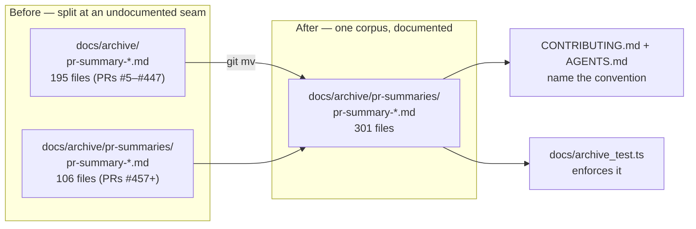

# PR Summary — Consolidate the PR-summary archive (Issue #792)

## Summary

The PR-summary archive was split across two undocumented locations: 195 summaries sat flat at
`docs/archive/pr-summary-*.md` (PRs #5–#447) while 106 sat under
`docs/archive/pr-summaries/pr-summary-*.md` (PRs #457 onward). Any tool, grep, or agent that globbed
one path silently missed the other — nearly two thirds of the corpus in the common case — and no
README, `AGENTS.md`, or `CONTRIBUTING.md` passage named either path as canonical.

This PR consolidates the archive to a single location and writes the convention down:

- `git mv`'d the 195 flat `docs/archive/pr-summary-*.md` files into `docs/archive/pr-summaries/` — a
  pure rename, no content edits, no learnings lost. There were no filename collisions between the
  two sets.
- Fixed the one relative link the extra directory level broke: `pr-summary-374.md` →
  `../../AGENTS.md` became `../../../AGENTS.md`. It was the only link in the moved files that
  resolved before the move (verified by resolving every non-HTTP link in all 195 files against the
  filesystem); the handful of already-broken historical links were left untouched as out of scope.
- `CONTRIBUTING.md` gains a **🗄️ PR-summary archive** subsection naming
  `docs/archive/pr-summaries/pr-summary-<PR>.md` as the one location, plus a PR-checklist item.
  `AGENTS.md` project structure gains the matching one-line entry.
- `CHANGELOG.md` records the consolidation under `[Unreleased]` → `Documented`.
- `docs/archive_test.ts` now enforces the layout, so the seam cannot re-open.

Closes #792.

## Evidence

Backend/docs-only change — there is no web interface to screenshot. The evidence is the test suite
plus the file counts.

Archive layout before and after:



File counts after the move:

```text
$ ls docs/archive/pr-summary-*.md 2>/dev/null | wc -l
0
$ ls docs/archive/pr-summaries/*.md | wc -l
301
```

Test run (the two new assertions fail against the unfixed tree and pass after the move — see Test
Plan):

```text
$ deno test --allow-read docs/archive_test.ts
PR summaries live in docs/archive/pr-summaries/ ... ok
No PR summary files remain in docs/ root ... ok
No PR summary files remain in docs/archive/ root ... ok
CONTRIBUTING.md documents the canonical PR-summary location ... ok
ok | 4 passed | 0 failed
```

`./quality.sh` was run to completion; see the PR conversation for the result.

## Test Plan

`docs/archive_test.ts` — rewritten around the canonical directory. Every test reads the real
filesystem or the real published document; none inspects source code.

| Test                                                          | Verifies                                                                            |
| ------------------------------------------------------------- | ----------------------------------------------------------------------------------- |
| `PR summaries live in docs/archive/pr-summaries/`             | The canonical directory is non-empty and every `pr-summary-*.md` entry is a file.   |
| `No PR summary files remain in docs/ root`                    | Retained from the previous suite — summaries never land back in `docs/`.            |
| `No PR summary files remain in docs/archive/ root`            | **New** — the seam this issue reports. Fails against the unfixed tree (195 strays). |
| `CONTRIBUTING.md documents the canonical PR-summary location` | **New** — the convention is written down. Fails against the unfixed tree.           |

Regression linkage: both new tests were written first and confirmed failing before the `git mv` and
the `CONTRIBUTING.md` edit (`FAILED | 2 passed | 2 failed`), then passing after
(`ok | 4 passed | 0 failed`).

No existing tests were removed or commented out; the two original assertions survive, one unchanged
in intent and one retargeted at the canonical directory (the old test allowed summaries in
`docs/archive/` root, which is exactly the behaviour this issue asks to end).
