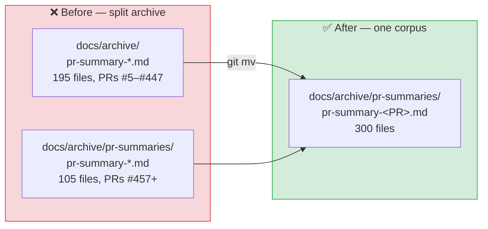

# PR Summary — Issue #792

## Summary

The PR-summary archive was split across two undocumented locations: 195 summaries sat flat at
`docs/archive/pr-summary-*.md` (PRs #5–#447) and 105 under `docs/archive/pr-summaries/` (PRs #457
onward), so any glob over one path silently missed the other. This PR consolidates the archive into
the single canonical directory `docs/archive/pr-summaries/` and writes the convention down. Closes
#792.

What changed:

- `git mv` of the 195 flat `docs/archive/pr-summary-*.md` files into `docs/archive/pr-summaries/` —
  a pure rename, no content changes, no learnings lost. There were no filename collisions between
  the two sets.
- Fixed the one relative link the move broke: `pr-summary-374.md` linked to `../../AGENTS.md`, now
  `../../../AGENTS.md` (the convention the existing subdirectory summaries already use). A sweep of
  every relative link in the moved files found this was the only one that resolved before the move.
- Documented the location in both `CONTRIBUTING.md` ("Where PR Summaries Live") and `AGENTS.md` ("PR
  Summaries"), including the `../../../` root-relative link depth for future summaries.
- Rewrote `docs/archive_test.ts` to pin the single location. **Existing tests were modified, not
  removed** — the old `PR summary files exist in docs/archive/` test asserted the flat layout that
  this change deliberately retires, so it now asserts the canonical directory instead. The "no
  summaries in `docs/` root" test is retained unchanged in behaviour.



## Evidence

This is a documentation/layout change with no web interface to screenshot. The evidence is the
archive-layout test suite and the full quality gate.

```
$ deno test --no-check --allow-read docs/archive_test.ts
running 4 tests from ./docs/archive_test.ts
PR summaries live in docs/archive/pr-summaries/ ... ok (7ms)
No PR summary files remain loose in docs/archive/ ... ok (124µs)
No PR summary files remain in docs/ root ... ok (264µs)
The archive location is documented ... ok (384µs)

ok | 4 passed | 0 failed (10ms)
```

Before the move, the two new assertions failed
(`Found PR summary files outside
docs/archive/pr-summaries/: pr-summary-289.md, …` and
`Expected CONTRIBUTING.md to name
docs/archive/pr-summaries/pr-summary-<PR>.md`), which is the
regression check for this issue: the suite is red against the split layout and green after
consolidation.

`./quality.sh < /dev/null` completed with exit code 0 — every section reported `SUCCESS` (Deno
Format, Bash Syntax, Deno Lint, Deno Type Check, Unit Tests, both MNIST isolated suites, and all 21
example runners), with no `FAILED` lines. `deno fmt` reflowed one paragraph in `pr-summary-374.md`
around the corrected link; that reflow is committed.

## Test Plan

- `docs/archive_test.ts::PR summaries live in docs/archive/pr-summaries/` — every summary is a file
  in the canonical directory and matches `pr-summary-<PR>.md`.
- `docs/archive_test.ts::No PR summary files remain loose in docs/archive/` — the regression test
  for the split seam; fails against the pre-move tree.
- `docs/archive_test.ts::No PR summary files remain in docs/ root` — retained from the previous
  suite.
- `docs/archive_test.ts::The archive location is documented` — `CONTRIBUTING.md` and `AGENTS.md`
  both name `docs/archive/pr-summaries/pr-summary-<PR>.md`, so the convention cannot quietly
  disappear.
- Full `./quality.sh` gate (bash syntax, `deno lint`, `deno fmt --check`, `deno check`, unit tests,
  example runners).
