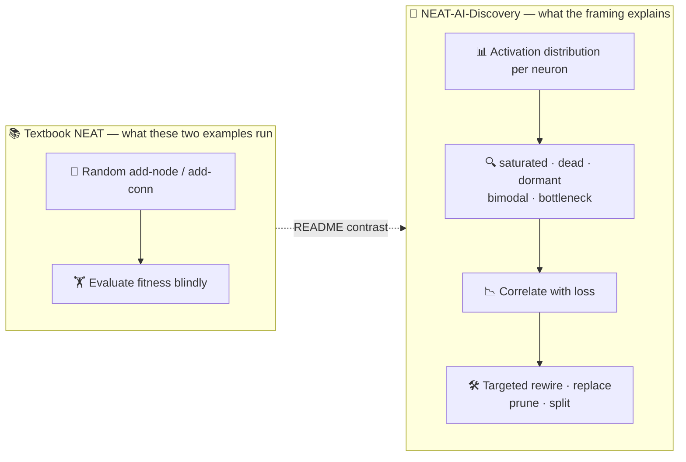

# PR Summary — Issue #797

## Summary

Restores the **science-driven structural mutation** framing that
[#189](https://github.com/stSoftwareAU/NEAT-AI-Examples/issues/189) (PR
[#197](https://github.com/stSoftwareAU/NEAT-AI-Examples/pull/197)) added to
[`discovery/README.md`](../../../discovery/README.md) and
[`discovery_at_scale/README.md`](../../../discovery_at_scale/README.md), and which the later #207 /
#208 audit rewrites dropped along with its test. Both READMEs now open with a short paragraph
contrasting textbook NEAT's blind random add-node / add-connection mutation against
NEAT-AI-Discovery's error-driven activation analysis (saturated · dead · dormant · bimodal ·
bottleneck → targeted rewire / replace / prune / split), linking
[NEAT-AI-Discovery](https://github.com/stSoftwareAU/NEAT-AI-Discovery) and upstream `COMPARISON.md`
Features 2 and 8.

The framing is written to stay **accurate** after the audit rewrites: each paragraph states plainly
that the runner itself grows its seed with `evolveDir`'s ordinary random mutation operators (the
#207 / #208 rule) rather than calling `Creature.discoveryDir(...)`, so the contrast frames the
measured run instead of misdescribing it.

A new [`discovery_readme_framing_test.ts`](../../../discovery_readme_framing_test.ts) enforces the
framing so the next rewrite cannot silently drop it again, and the four
[`docs/neat_ai_feature_audit.md`](../../neat_ai_feature_audit.md) rows that recorded the gap (the
Error-Guided Structural Evolution and GPU-Accelerated Discovery capability rows, plus the register
rows for both examples) are flipped to ✅ Resolved. The two matching "phrasings to fix" rows,
reporter point 3, and the regression note are updated for the same reason — leaving them would make
the audit contradict its own resolved rows.

Closes #797.

## Evidence

Documentation-only change — no runtime behaviour, CLI, or web surface is modified, so there is
nothing to screenshot. The evidence is the new test suite, which fails against the pre-change
READMEs and passes after them.

Before the change (all 9 tests red):

```text
FAILED | 0 passed | 9 failed (11ms)
```

After the change, together with the existing audit test:

```text
running 6 tests from ./docs/neat_ai_feature_audit_test.ts
running 9 tests from ./discovery_readme_framing_test.ts
ok | 15 passed | 0 failed (134ms)
```

What the restored framing asserts, and where each half lives:



## Test Plan

- Added `discovery_readme_framing_test.ts` (9 tests) — "what" tests reading the published READMEs:
  - each README's opening section (H1 → first `##`) states the framing (`science-driven`,
    `structural mutation`, `error-driven`);
  - each contrasts it with `textbook NEAT` / `random` mutation;
  - each names all five activation categories the analysis flags;
  - each links `https://github.com/stSoftwareAU/NEAT-AI-Discovery`;
  - `docs/neat_ai_feature_audit.md` carries no un-resolved row still calling the framing
    missing/absent for either Discovery README.
- Existing `docs/neat_ai_feature_audit_test.ts` (6 tests) re-run — the flipped rows keep the
  struck-quote and live-accusation invariants green.
- `markdownlint-cli2@0.22.1` over the three changed Markdown files — 0 errors.
- Full `./quality.sh` run.
