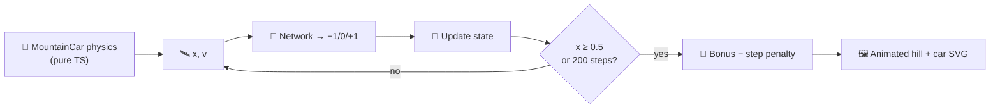

# Mountain Car Control Example

## Summary

Adds a new `mountain_car/` example that evolves a NEAT-AI controller to drive an under-powered car
up a sinusoidal hill — the second canonical OpenAI-Gym RL benchmark — and renders an animated SVG of
the champion's swing-up to the goal flag. The simulator, evolutionary loop, and SVG renderer are
pure TypeScript, matching the style of the existing cart-pole and lunar-lander examples. Closes #80.

## Evidence

- The runner solves the task end-to-end: `./mountain_car/run.sh` evolves a champion that crosses
  `x ≥ 0.5` within the 200-step horizon and writes `docs/screenshots/mountain_car.svg`.
- `./quality.sh` passes end-to-end (lint, format, type check, 434 unit tests, all example runners
  including the new Mountain Car runner).
- Animated SVG (committed at `docs/screenshots/mountain_car.svg`):

  

## Test Plan

New `mountain_car/` test files:

- `mountain_car/physics_test.ts` — 16 "what" tests covering:
  - Happy path: applying `+1` from rest at `x = -0.5` produces velocity and position matching the
    published OpenAI-Gym reference values to 1e-12 precision.
  - Edge case: hitting the left wall sets velocity to zero.
  - Determinism: identical inputs produce identical outputs; the canonical 200-step horizon is
    intact; the hand-crafted swing-up policy solves the task.
- `mountain_car/mountain_car_test.ts` — 18 tests covering creature construction, gene round-trip,
  argmax-based action decoding, evolutionary search (champion solves the task with the default
  seed), reproducibility (fixed seed yields a byte-identical champion), and SVG output structure
  (SMIL animation primitives, goal flag, indefinite repeat, success-colour keyframe).

Wiring:

- `quality.sh` runs the new example after Lunar Lander and cleans `.synthetic-mountain-car/`.
- Top-level `README.md` Examples table, Screenshots section, and architecture mermaid diagrams
  include Mountain Car.
- `readme_structure_test.ts` lists `mountain_car` as a required example directory and screenshot.
- `docs/archive_test.ts` allowlists `pr-summary-80.md` (and the pre-existing 72/77 entries).
