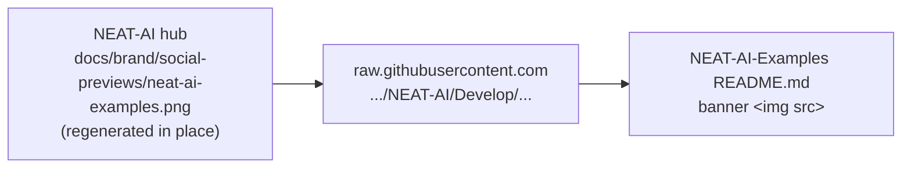

# PR Summary — Branding: use the hub social preview in the README (Issue #803)

## Summary

The root `README.md` now leads with this repository's NEAT-AI family social preview, hot-linked from
the hub rather than copied here. Closes #803.

The hub ([NEAT-AI#3764](https://github.com/stSoftwareAU/NEAT-AI/issues/3764), PR
[#3766](https://github.com/stSoftwareAU/NEAT-AI/pull/3766)) owns the artwork and regenerates each
per-repo preview **in place** at the same committed path. Referencing the hub's raw `Develop` URL
means a hub refresh — including the transparent light/dark regeneration — propagates here with no
follow-up PR. Siblings pull, they do not copy: no image binary is committed.

Scope is the root `README.md` only. Per-example READMEs stay walkthroughs; they do not repeat the
family lockup. The GitHub **Settings → General → Social preview** upload remains a separate human
step (use the hub's opaque variant at `docs/brand/social-previews/opaque/neat-ai-examples.png`).

## Evidence

Documentation-only change — there is no web interface to screenshot, and deliberately no image was
saved into this repository. Verified instead:

- The hot-linked URL resolves — `curl` against
  `https://raw.githubusercontent.com/stSoftwareAU/NEAT-AI/Develop/docs/brand/social-previews/neat-ai-examples.png`
  returns `200` and `image/png`.
- `deno test readme_brand_banner_test.ts` — both cases fail against the unfixed README and pass
  after the banner is added.
- `markdownlint-cli2 README.md` — 0 errors (MD033 inline HTML is already permitted by
  `.markdownlint-cli2.jsonc`).

## Test Plan

- Added `readme_brand_banner_test.ts`, which reads the published root README and asserts:
  - the opening section (H1 to the first `##`) embeds exactly one banner whose `src` is the hub's
    raw `Develop` URL for `neat-ai-examples.png`;
  - the alt text is non-empty and names this repository;
  - no image `src` is a relative `docs/brand/` path, and
    `docs/brand/social-previews/neat-ai-examples.png` is not committed here.
- Re-ran the existing root-README consumer (`mnist_classification/mnist_classification_test.ts`
  MNIST wording check) — unaffected.
