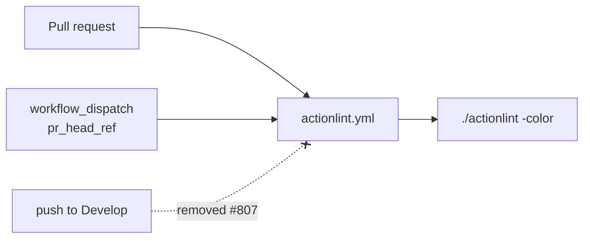

# Drop the push-to-`Develop` trigger from the Actionlint workflow

## Summary

`.github/workflows/actionlint.yml` is a PR gate, but it also fired on every push to the default
branch. Once the check is required, each merge into `Develop` re-ran a lint that had already passed
on the pull request — duplicate CI minutes, and a chance of a red tick on `Develop` for a check that
was already green.

The `push:` block is removed; the `pull_request` (`branches: ["**"]`) and `workflow_dispatch`
triggers are untouched, so PR gating and the CI re-dispatch helper behave exactly as before. Closes
#807.

## Evidence

Backend/CI-only change — no web interface to screenshot.

- `deno test --no-check --allow-read --allow-write --allow-env --allow-net
  --allow-run=df,bash,git,deno .github/`
  → `121 passed | 0 failed`, including the inverted trigger test.
- `actionlint .github/workflows/actionlint.yml` → exit 0, so the trimmed `on:` block is still a
  valid workflow.
- `deno fmt --check` and `deno lint` on the modified test file → clean.

## Test Plan

- `.github/actionlint_workflow_test.ts` — the existing
  `actionlint workflow — triggers on push to Develop` test asserted the behaviour this issue
  removes, so it is **inverted, not deleted**, and renamed
  `actionlint workflow — does not re-run on push to Develop`. It fails against the unfixed workflow
  (`got ["Develop"]`) and passes after the fix, keeping the trigger pinned in both directions. This
  is the documented business-logic test change required by the issue.
- The workflow's other pinned behaviours (PR `branches: ["**"]`, `workflow_dispatch.pr_head_ref`,
  read-only `contents` permission, `ubuntu-latest`, the SHA-256-pinned installer) are still covered
  by the unchanged tests in the same file.

## Scope

Only `actionlint.yml` and its test file changed. The sibling findings for `markdown-lint.yml` (#808)
and `quality.yml` (#809) are tracked separately and are deliberately untouched here.
