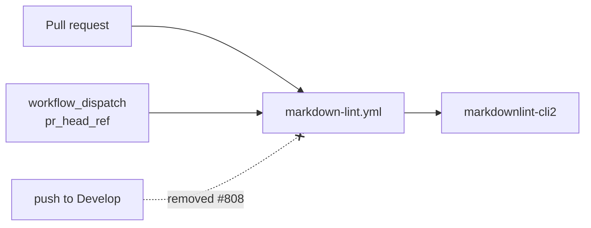

# Drop the push-to-`Develop` trigger from the Markdown Lint workflow

## Summary

`.github/workflows/markdown-lint.yml` is a PR gate, but it also fired on every push to the default
branch. Once the check is required, each merge into `Develop` re-ran a lint that had already passed
on the pull request — duplicate CI minutes, and a chance of a red tick on `Develop` for a check that
was already green.

The `push:` block is removed; the `pull_request` (`branches: ["**"]`) and `workflow_dispatch`
triggers are untouched, so PR gating and the CI re-dispatch helper behave exactly as before. This
mirrors the same fix already applied to `actionlint.yml` (#807). Closes #808.

## Evidence

Backend/CI-only change — no web interface to screenshot.

- `deno test --no-check --allow-read --allow-write --allow-env --allow-net
  --allow-run=df,bash,git,deno .github/`
  → `121 passed | 0 failed`, including the inverted trigger test.
- The regression test was observed red against the unfixed workflow
  (`push must not reach the default branch 'Develop' … (got ["Develop"])`) and green after the
  `push:` block was removed.
- `./quality.sh` → `All examples passed!` (exit 0), covering `deno lint`, `deno fmt --check`, the
  type check, the full unit-test suite and the example runs.

## Test Plan

- `.github/markdown_lint_workflow_test.ts` — the existing
  `markdown-lint workflow — triggers on push to Develop` test asserted the behaviour this issue
  removes, so it is **inverted, not deleted**, and renamed
  `markdown-lint workflow — does not re-run on push to Develop`. It fails against the unfixed
  workflow and passes after the fix, keeping the trigger pinned in both directions. This is the
  documented business-logic test change required by the issue.
- The workflow's other pinned behaviours (PR `branches: ["**"]`, the exact-version
  `markdownlint-cli2` pin from #442, `persist-credentials: false` from #814, and the ref-keyed
  concurrency group from #554) are still covered by the unchanged tests in the same file and in
  `.github/workflow_branch_filter_test.ts` / `.github/concurrency_workflow_test.ts`.

## Scope

Only `markdown-lint.yml` and its test file changed. The sibling finding for `quality.yml` (#809) is
tracked separately and is deliberately untouched here. SVGs regenerated as a side effect of running
`./quality.sh` were reverted — they are non-deterministic example output, not part of this fix.
