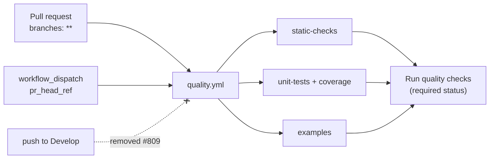

# Drop the push-to-`Develop` trigger from the Quality Check workflow

## Summary

`.github/workflows/quality.yml` is a PR gate, but it also fired on every push to the default branch.
Each merge into `Develop` re-ran a gate that had already passed on the pull request — and this is
the repository's most expensive duplicate, because the `unit-tests` job rebuilds `rust_scorer` and
re-runs the whole Deno suite. It could also leave a red tick on `Develop` for a check that was
already green.

The `push:` block is removed. The `pull_request` (`branches: ["**"]`) and `workflow_dispatch`
triggers are untouched, so PR gating and the CI re-dispatch helper behave exactly as before, and the
required `Run quality checks` aggregate status still reports on every pull request. This completes
the same fix already applied to `actionlint.yml` (#807) and `markdown-lint.yml` (#808) — `quality.yml`
was the last checker still triggering on push. Closes #809.

## Evidence

Backend/CI-only change — no web interface to screenshot.

- The regression test was observed red against the unfixed workflow
  (`push must not reach the default branch 'Develop' … (got ["Develop"])`) and green after the
  `push:` block was removed.
- `deno test --no-check --allow-read --allow-write --allow-env --allow-net
  --allow-run=df,bash,git,deno .github/ quality_workflow_*.ts workflow_secret_job_isolation_test.ts`
  → `137 passed | 0 failed`, covering every other pinned property of this workflow (job timeouts,
  non-persisted checkout credentials, secret-job isolation, PR branch globs, Codecov action pin).
- `./quality.sh` → see the gate note at the end of this summary.

## Reviewer notes

- **README badge** — the badge was pinned to `?branch=Develop`, which only ever matched the push
  runs this change removes; left alone it would freeze on the last pre-merge run. It now uses
  `?event=pull_request`. Verified live against the sibling workflows that already dropped their push
  trigger: `markdown-lint.yml/badge.svg?event=pull_request` and
  `actionlint.yml/badge.svg?event=pull_request` both render `passing` today.
- **Codecov** — the `coverage-upload` job now runs on pull requests only, so no new coverage report
  is uploaded for a `Develop` commit after a merge. Codecov comparisons continue to use the pull
  request's own report; `fail_ci_if_error` is already `false`, so nothing here can block a PR.

## Test Plan

- `quality_workflow_pr_branches_test.ts` — the existing `push stays scoped to the Develop default
  branch` test asserted the behaviour this issue removes, so it is **inverted, not deleted**, and
  renamed `push does not re-run the gate on Develop`. It parses the workflow YAML and asserts no
  `push` branch filter matches `Develop` (or a `milestone/<slug>` branch). It fails against the
  unfixed workflow and passes after the fix, keeping the trigger pinned in both directions. This is
  the documented business-logic test change.
- The two `pull_request` tests in the same file are unchanged and still pin PR gating on `Develop`
  and on `milestone/<slug>` base branches (#677).
