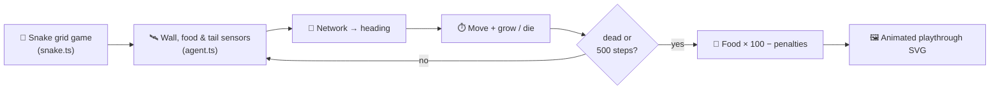

# Add Snake Game example with animated playthrough SVG

## Summary

Adds a new `snake_game/` example that evolves a NEAT-AI controller to play the classic Snake grid
game on a 12×12 board, plus an animated SVG playthrough rendered to
`docs/screenshots/snake_game.svg`. The example follows the same shape as the other control examples
(`mountain_car/`, `lunar_lander/`, `cart_pole/`): pure-TypeScript simulator, sensor + action
encoding, evolutionary loop, animated SVG renderer, "what" tests, and a `run.sh`. Wires into the
project quality gate (`quality.sh`), the top-level README's Examples table and Screenshots section,
and the README structure tests. Closes #81.

## Evidence

The change is a CLI / simulation example with no web UI to screenshot. Visual verification comes
from the committed `docs/screenshots/snake_game.svg`, which is animated SMIL output.

Pipeline (matches the issue diagram):



Champion run (default seed):

- Champion ate **1 food** in **10 steps** (score = 49.00) after 80 generations.
- `./quality.sh` passes end-to-end (lint, fmt, type-check, **474 unit tests**, all 11 example
  runners including the new Snake one).

## Test Plan

New tests added under `snake_game/`:

- `snake_test.ts` — game model:
  - Happy path: snake placed next to food eats it, length increments, food respawns off-body.
  - Wall collision ends the episode.
  - Self collision ends the episode.
  - 180° reversal request is ignored.
  - Non-eating move keeps body length constant.
  - `spawnFood`, `inBounds`, `cellsEqual`, `isReverse` boundary cases.
  - `newGame` is deterministic for the same seed.
- `agent_test.ts` — sensor encoding & action decoding:
  - Encoded vector has exactly `INPUT_COUNT` channels.
  - Wall distances respect the grid bounds.
  - Food and tail deltas point in the correct direction.
  - Length sensor scales with body size.
  - `headingLeft` / `headingRight` rotate cardinally.
  - `decodeAction` picks the argmax.
- `snake_game_test.ts` — evolutionary loop & SVG renderer:
  - `buildInitialCreatureJSON` shape and validation.
  - `genesFromCreatureJSON` round-trips weights and biases.
  - `randomCreatureJSON` deterministic for same seed.
  - `mutateCreatureJSON` yields a valid creature.
  - `scoreController` returns a finite score.
  - **`evolveSnakeController` champion eats at least one food item** (acceptance criterion).
  - **Reproducibility** — same seed produces a byte-identical champion.
  - Different seeds produce different champions.
  - `replayController` emits a non-empty trace starting at the initial state.
  - `renderRunSVG` emits an `<svg>` root with SMIL animation elements, looping `repeatCount`,
    snake-head/food/board classes, and rejects an empty trace.

Existing tests updated:

- `readme_structure_test.ts` — `EXAMPLE_DIRS`, `SCREENSHOT_PATHS`, and the required example-name
  list now include `snake_game` / `snake_game.svg` / "Snake".

Run them locally:

```bash
deno test --no-check --allow-read --allow-write --allow-env --allow-net snake_game/
./quality.sh
```
