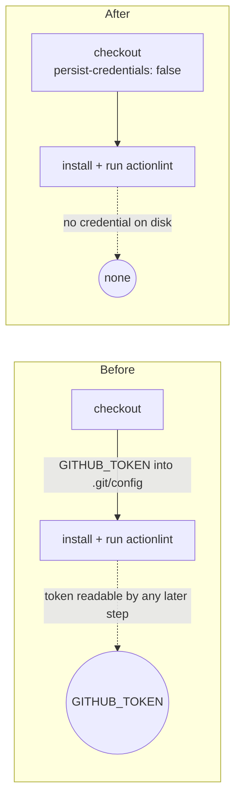

# Drop the persisted credential from the actionlint checkout (Issue #810)

## Summary

The `actionlint` job's `actions/checkout` step ran without `persist-credentials: false`, so the
workflow `GITHUB_TOKEN` was written into `.git/config` as an auth header and stayed readable for the
whole job. The job only downloads the pinned actionlint binary and lints the checked-out workflows —
it never pushes back to the repository and fetches no private submodule — so the credential buys
nothing and only widens the blast radius of a compromised download or lint step.

Set `persist-credentials: false` on that checkout, matching the fixes already landed for
`static-checks` (#816), `unit-tests` (#818), the NEAT-AI-core checkout (#819) and `semgrep` (#820).
Closes #810.

## Evidence

Backend/CI-only change — there is no web interface to screenshot. The deliverable is the workflow
YAML, so the evidence is the new parse-and-assert test:

```
$ deno test --allow-read actionlint_workflow_credential_test.ts

# before the fix
actionlint.yml actionlint job — every checkout drops the credential ... FAILED
  AssertionError: Values are not equal: checkout step "Check out repository" must set
  persist-credentials: false ...
  -   undefined
  +   false
FAILED | 1 passed | 1 failed (50ms)

# after the fix
actionlint.yml actionlint job — every checkout drops the credential ... ok (4ms)
actionlint.yml actionlint job — no step pushes back to the repository ... ok (965µs)
ok | 2 passed | 0 failed (35ms)
```

Token flow before and after:



## Test Plan

- Added `actionlint_workflow_credential_test.ts`:
  - `actionlint.yml actionlint job — every checkout drops the credential` — parses the workflow and
    asserts every `actions/checkout` step in the `actionlint` job sets `persist-credentials: false`.
    Observed failing before the fix and passing after it.
  - `actionlint.yml actionlint job — no step pushes back to the repository` — guards the premise of
    the fix, so a future `git push` step in this job trips the test rather than silently needing the
    credential back.
- `./quality.sh` was run in full. Format, bash syntax, lint, type check and the unit test suite pass
  (`ok | 1431 passed (32 steps) | 0 failed`). The example programs fail on this container for a
  pre-existing environmental reason unrelated to this change: `rustup-init` refuses to install over
  the image's existing Rust (`error: cannot install while Rust is installed`) and the preamble then
  exits with `ERROR: rustup installation appears incomplete`, so every example aborts before running
  any code. The same failure is recorded in the summaries for #809, #816, #819 and #820, and a
  one-line YAML change cannot influence Rust toolchain installation.
