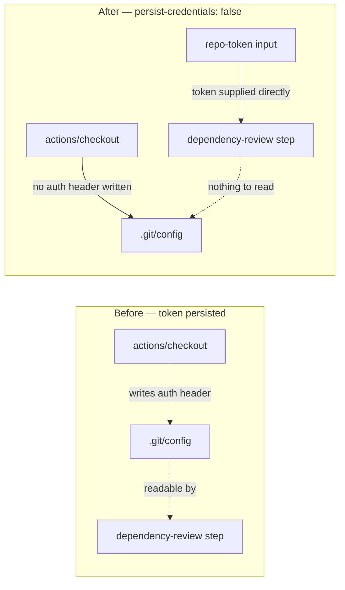

# PR Summary — Issue #812

## Summary

The `dependency-review` job in `.github/workflows/dependency-review.yml` checked the repository out
without `persist-credentials: false`, so `actions/checkout` wrote the workflow `GITHUB_TOKEN` into
`.git/config` as an auth header where any later step in the job could read it back and act as the
token.

The job only resolves the PR comparison refs and runs `actions/dependency-review-action` over the
dependency-graph diff — it never pushes back to the repository and fetches no private submodule — so
the persisted credential buys nothing and only widens the blast radius of a compromised step. The
review action receives its own token through `repo-token` (defaulting to `github.token`), not from
`.git/config`, so dropping the persisted credential does not affect it. The checkout now sets
`persist-credentials: false`, matching every other workflow in this repository (`quality.yml`,
`semgrep.yml`, `gitleaks.yml`, `actionlint.yml`, `markdown-lint.yml`, `deno-audit.yml`,
`deno-outdated.yml`, `deno-security-update.yml`).

Closes #812.

## Evidence

Backend/CI change — there is no web interface to screenshot. The deliverable is the workflow YAML,
so the evidence is the new parsing test observed red against the unfixed workflow and green after
the fix.

Before the fix (`deno test --allow-read dependency_review_workflow_credential_test.ts`):

```text
[Diff] Actual / Expected
-   undefined
+   false
FAILED | 1 passed | 1 failed (19ms)
```

After the fix:

```text
dependency-review.yml dependency-review job — every checkout drops the credential ... ok (3ms)
dependency-review.yml dependency-review job — no step pushes back to the repository ... ok (913µs)
ok | 2 passed | 0 failed (7ms)
```

Credential flow before and after:



## Test Plan

- Added `dependency_review_workflow_credential_test.ts`:
  - `dependency-review.yml dependency-review job — every checkout drops the credential` — parses the
    workflow YAML and asserts every `actions/checkout` step in the `dependency-review` job sets
    `persist-credentials: false`. Fails against the unfixed workflow.
  - `dependency-review.yml dependency-review job — no step pushes back to the repository` — guards
    the premise of the fix, so a future step that pushes forces the trade-off to be re-assessed
    rather than silently breaking.
- Ran `deno fmt --check` and `deno lint` on the new test file — both clean.
- Ran `./quality.sh` (full gate).
