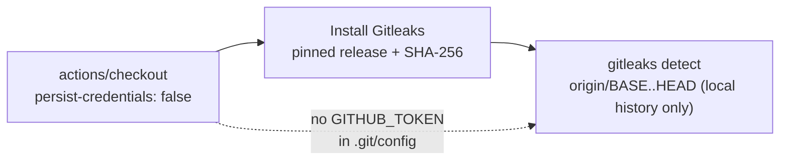

# Stop the gitleaks checkout persisting the workflow token

## Summary

`actions/checkout` writes the job's `GITHUB_TOKEN` into `.git/config` as an auth header unless
`persist-credentials: false` is set. The `gitleaks` job only _reads_ local history — it runs
`gitleaks detect --log-opts "origin/<base>..HEAD"`, never pushes, and fetches no private submodule —
so the persisted credential bought nothing while staying readable by every later step in the job
(including the downloaded `gitleaks` binary itself).

`.github/workflows/gitleaks.yml` now sets `persist-credentials: false` on the checkout step.
`fetch-depth: 0` still fetches all branches and tags during checkout, so `origin/<base>` is present
locally for the scan and no post-checkout fetch is needed.

Closes #813.

## Evidence

Backend/CI-only change — no web interface to screenshot. Verified by the workflow policy tests in
`.github/gitleaks_workflow_test.ts`, which parse the committed YAML and assert on its effective
structure:

```
$ deno test --allow-read --allow-write --allow-run --allow-env .github/
ok | 119 passed (32 steps) | 0 failed (10s)
```

The new `persist-credentials` test was observed failing against the unfixed workflow
(`Actual: undefined / Expected: false`) and passing after the fix.



## Test Plan

Added to `.github/gitleaks_workflow_test.ts`:

- `gitleaks workflow — checkout does not persist a credential in the workspace` — every
  `actions/checkout` step in the workflow must set `persist-credentials: false`.
- `gitleaks workflow — no step pushes back to the repository` — guards the premise of the fix, so a
  future `git push` added to this job fails loudly rather than silently relying on a credential that
  is no longer there.
