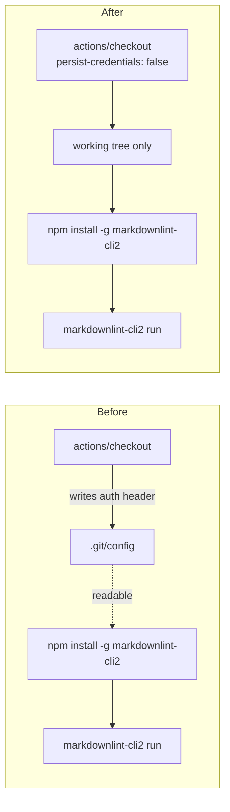

# PR Summary — Issue #814

## Summary

`actions/checkout` writes the job's `GITHUB_TOKEN` into `.git/config` as an auth
header unless `persist-credentials: false` is set. The `markdownlint` job in
`.github/workflows/markdown-lint.yml` only lints the checked-out Markdown — it
never pushes and fetches no private submodule — so the persisted credential
bought nothing while leaving the token readable by every later step, including
the globally installed `markdownlint-cli2` npm package.

This PR sets `persist-credentials: false` on that checkout and guards the
setting with tests so the credential cannot silently come back. Closes #814.

## Evidence

Backend/CI-only change — there is no web interface to screenshot. The evidence
is the test run: the new assertion was observed failing against the unfixed
workflow and passing after the fix.

Before the fix:

```text
markdown-lint workflow — checkout does not persist a credential in the workspace => FAILED
  AssertionError: Values are not equal: checkout step "Check out repository" must set
  persist-credentials: false — the job never pushes, so the GITHUB_TOKEN must not be
  left readable in .git/config
  -   undefined
  +   false
FAILED | 4 passed | 1 failed
```

After the fix:

```text
deno test --allow-read .github/markdown_lint_workflow_test.ts
ok | 5 passed | 0 failed
```

The whole `.github` policy suite also passes: `121 passed | 0 failed`.

Credential flow before and after:



## Test Plan

Added to `.github/markdown_lint_workflow_test.ts`:

- `markdown-lint workflow — checkout does not persist a credential in the workspace`
  — every `actions/checkout` step in the workflow must set
  `persist-credentials: false`.
- `markdown-lint workflow — no step pushes back to the repository` — guards the
  premise of the fix: if a future step starts pushing, the dropped credential
  would break it, so the test fails and forces a re-assessment.

Commands run:

- `deno test --allow-read .github/markdown_lint_workflow_test.ts` — 5 passed.
- `deno test .github/` — 121 passed.
- `deno fmt --check`, `deno lint`, `deno check` on the changed test file — clean.
- `./quality.sh` — full gate.
