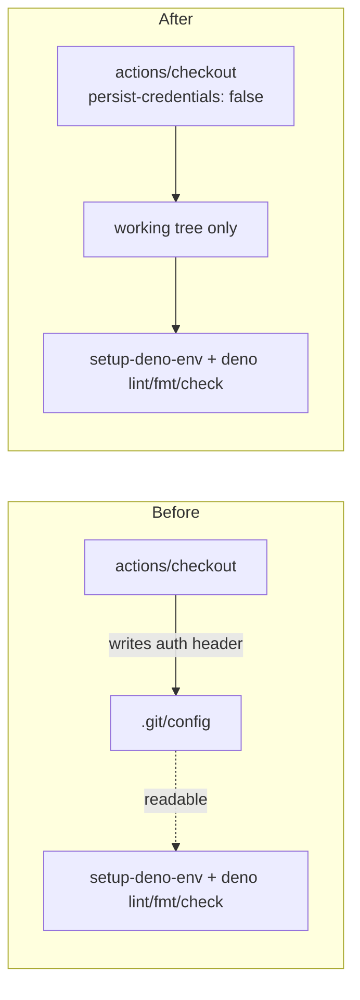

# PR Summary — Issue #816

## Summary

`actions/checkout` writes the job's `GITHUB_TOKEN` into `.git/config` as an auth header unless
`persist-credentials: false` is set. The `static-checks` job in `.github/workflows/quality.yml` only
runs `deno lint`, `deno fmt --check` and `deno check` — it never pushes back to the repository and
fetches no private submodule — so the persisted credential bought nothing while leaving the token
readable by every later step, including the Deno setup action and any compromised dependency it
pulls in.

This PR sets `persist-credentials: false` on that checkout and guards the setting with tests so the
credential cannot silently come back. It completes the sweep started by #814 (`markdownlint`), #815
(`examples`) and #817 (`unit-tests`) — every own-repository checkout in `quality.yml` now drops the
credential. Closes #816.

## Evidence

Backend/CI-only change — there is no web interface to screenshot. The evidence is the test run: the
new assertion was observed failing against the unfixed workflow and passing after the fix.

Before the fix:

```text
quality.yml static-checks job — checkout does not persist a credential => FAILED
  AssertionError: Values are not equal: checkout step "Check out repository" must set
  persist-credentials: false — the job never pushes, so the GITHUB_TOKEN must not be
  left readable in .git/config
  -   undefined
  +   false
FAILED | 1 passed | 1 failed (22ms)
```

After the fix:

```text
deno test --allow-read quality_workflow_static_checks_credential_test.ts
ok | 2 passed | 0 failed
```

The other workflow-policy tests still pass: `36 passed | 0 failed` across
`quality_workflow_*_test.ts`, `workflow_secret_job_isolation_test.ts` and `deno_workflow_*_test.ts`.

Credential flow before and after:



## Test Plan

Added `quality_workflow_static_checks_credential_test.ts`:

- `quality.yml static-checks job — checkout does not persist a credential` — every
  `actions/checkout` step in the `static-checks` job must set `persist-credentials: false`.
- `quality.yml static-checks job — no step pushes back to the repository` — guards the premise of
  the fix: if a future step starts pushing, the dropped credential would break it, so the test fails
  and forces a re-assessment.

Commands run:

- `deno test --allow-read quality_workflow_static_checks_credential_test.ts` — 2 passed (observed
  failing before the workflow edit).
- `deno test --allow-read quality_workflow_*_test.ts workflow_secret_job_isolation_test.ts deno_workflow_*_test.ts`
  — 36 passed.
- `deno fmt --check`, `deno lint`, `deno check` on the new test file — clean.
- `./quality.sh` — run in full. Two pre-existing, unrelated failures in this container, both from an
  incomplete `rustup` install (`ERROR: rustup installation appears incomplete`): every example
  runner step, and
  `common/ensure_neat_ai_native_scorer_test.ts::example runner preamble sets scoped
  --allow-run for rust_scorer under set -u`.
  Both were confirmed to fail identically on a clean tree (`git stash -u` → same failure), so they
  are not caused by this change. All other checks — Deno Format, Bash Syntax, Deno Lint, Deno Type
  Check, and the remaining 1424 unit tests — passed.
