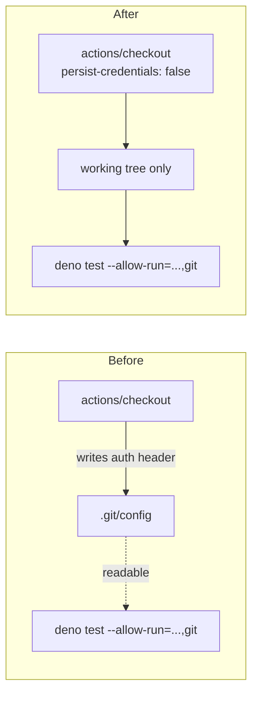

# PR Summary — Issue #817

## Summary

`actions/checkout` writes the job's `GITHUB_TOKEN` into `.git/config` as an auth header unless
`persist-credentials: false` is set. The `unit-tests` job in `.github/workflows/quality.yml` never
pushes back to the repository and fetches no private submodule, so the persisted credential bought
nothing — and this is the job that runs the PR's own test suite with
`--allow-run="df,bash,git,deno"`, so any test could have read the token back with a single
`git config --get http.https://github.com/.extraheader`.

This PR sets `persist-credentials: false` on that checkout and guards the setting with tests so the
credential cannot silently come back. The two sibling checkouts (`NEAT-AI-scorer`, `NEAT-AI-core`)
are out of scope for this finding and are left unchanged. Closes #817.

## Evidence

Backend/CI-only change — there is no web interface to screenshot. The evidence is the test run: the
new assertion was observed failing against the unfixed workflow and passing after the fix.

Before the fix:

```text
quality.yml unit-tests job — checkout does not persist a credential => FAILED
  AssertionError: Values are not equal: checkout step "Check out repository" must set
  persist-credentials: false — the job never pushes, so the GITHUB_TOKEN must not be
  left readable in .git/config
  -   undefined
  +   false
FAILED | 1 passed | 1 failed
```

After the fix:

```text
deno test --allow-read quality_workflow_unit_tests_credential_test.ts
ok | 2 passed | 0 failed
```

The other workflow-policy tests still pass: `34 passed | 0 failed` across
`quality_workflow_*_test.ts`, `workflow_secret_job_isolation_test.ts` and `deno_workflow_*_test.ts`.

Credential flow before and after:



## Test Plan

Added `quality_workflow_unit_tests_credential_test.ts`:

- `quality.yml unit-tests job — checkout does not persist a credential` — every `actions/checkout`
  step in the `unit-tests` job that clones this repository must set `persist-credentials: false`.
- `quality.yml unit-tests job — no step pushes back to the repository` — guards the premise of the
  fix: if a future step starts pushing, the dropped credential would break it, so the test fails and
  forces a re-assessment.

Commands run:

- `deno test --allow-read quality_workflow_unit_tests_credential_test.ts` — 2 passed.
- `deno test --allow-read quality_workflow_*_test.ts workflow_secret_job_isolation_test.ts deno_workflow_*_test.ts`
  — 34 passed.
- `deno fmt --check`, `deno lint`, `deno check` on the new test file — clean.
- `./quality.sh` — full gate.
