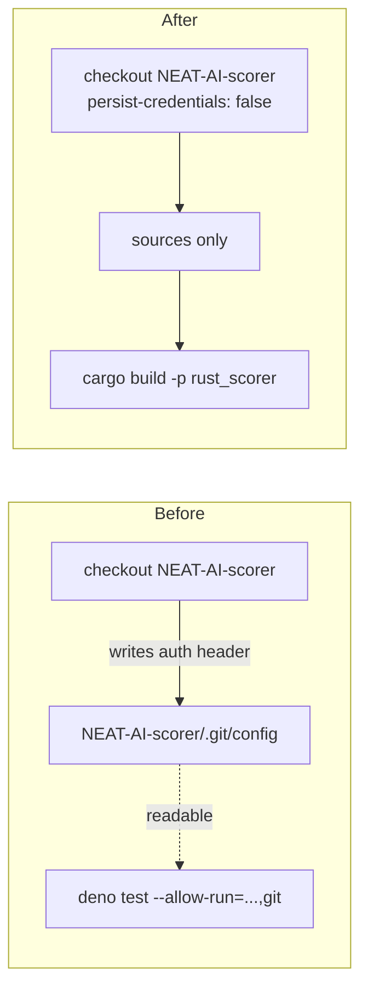

# PR Summary — Issue #818

## Summary

`actions/checkout` writes the job's `GITHUB_TOKEN` into the checked-out repository's `.git/config`
as an auth header unless `persist-credentials: false` is set. In the `unit-tests` job of
`.github/workflows/quality.yml`, the **NEAT-AI-scorer** checkout still did that, so the token sat in
`NEAT-AI-scorer/.git/config` for the rest of the job — the job that runs the pull request's own test
suite with `--allow-run="df,bash,git,deno"`. Any test could have read it back with
`git config --get http.https://github.com/.extraheader`.

Nothing in the job pushes to `NEAT-AI-scorer` or fetches a private submodule from it — the checkout
exists only so `cargo build -p rust_scorer` has the sources — so the persisted credential bought
nothing. This PR sets `persist-credentials: false` on that checkout and guards it with a test.
Closes #818.

The sibling `NEAT-AI-core` checkout is a separate finding (#819) and is deliberately left unchanged;
the own-repository checkout was already fixed under #817.

## Evidence

Backend/CI-only change — there is no web interface to screenshot. The evidence is the test run: the
new assertion was observed failing against the unfixed workflow and passing after the fix.

Before the fix:

```text
quality.yml unit-tests job — NEAT-AI-scorer checkout does not persist a credential => FAILED
  AssertionError: Values are not equal: checkout step "Check out NEAT-AI-scorer for MNIST
  CATEGORICAL_ERROR tests" must set persist-credentials: false — nothing in this job pushes
  to NEAT-AI-scorer, so the GITHUB_TOKEN must not be left readable in its .git/config
  (Issue #818)
  -   undefined
  +   false
FAILED | 2 passed | 1 failed
```

After the fix, the whole workflow-policy suite passes:

```text
deno test --allow-read quality_workflow_*_test.ts workflow_secret_job_isolation_test.ts \
  deno_workflow_*_test.ts
ok | 35 passed | 0 failed
```

Credential flow for the scorer checkout, before and after:



## Test Plan

- Added `quality.yml unit-tests job — NEAT-AI-scorer checkout does not persist a credential` to
  `quality_workflow_unit_tests_credential_test.ts`: parses the workflow YAML and asserts the
  `stSoftwareAU/NEAT-AI-scorer` checkout step sets `persist-credentials: false`.
- Existing tests in that file (own-repo checkout, no `git push` in the job) still pass unchanged.
- Full workflow-policy suite: 35 passed, 0 failed.
