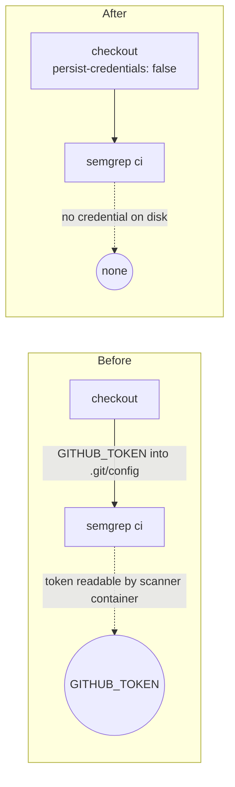

# Drop the persisted credential from the semgrep checkout (Issue #820)

## Summary

The `semgrep` job's `actions/checkout` step ran without `persist-credentials: false`, so the
workflow `GITHUB_TOKEN` was written into `.git/config` as an auth header and stayed readable for the
whole job. The job only runs `semgrep ci --config p/default` over the checked-out tree — it never
pushes back to the repository and fetches no private submodule — so the credential buys nothing and
only widens the blast radius of a compromised ruleset or dependency inside the scanner container.

Set `persist-credentials: false` on that checkout, matching the fixes already landed for
`static-checks` (#816), `unit-tests` (#818) and the NEAT-AI-core checkout (#819). Closes #820.

## Evidence

Backend/CI-only change — there is no web interface to screenshot. The deliverable is the workflow
YAML, so the evidence is the new parse-and-assert test:

```
$ deno test --allow-read=. semgrep_workflow_credential_test.ts

# before the fix
semgrep.yml semgrep job — every checkout drops the credential ... FAILED
  AssertionError: Values are not equal: checkout step "Check out repository" must set
  persist-credentials: false ...
  -   undefined
  +   false
FAILED | 1 passed | 1 failed

# after the fix
semgrep.yml semgrep job — every checkout drops the credential ... ok (3ms)
semgrep.yml semgrep job — no step pushes back to the repository ... ok (765µs)
ok | 2 passed | 0 failed
```

Token flow before and after:



## Test Plan

- Added `semgrep_workflow_credential_test.ts`:
  - `semgrep.yml semgrep job — every checkout drops the credential` — parses the workflow and
    asserts every `actions/checkout` step in the `semgrep` job sets `persist-credentials: false`.
    Observed failing before the fix and passing after it.
  - `semgrep.yml semgrep job — no step pushes back to the repository` — guards the premise of the
    fix, so a future `git push` step in this job trips the test rather than silently needing the
    credential back.
- `./quality.sh` was run in full. Format, bash syntax, lint and type check pass. Two pre-existing
  failures are unrelated to this change and reproduce on a clean tree (verified with the change
  stashed):
  - `common/ensure_neat_ai_native_scorer_test.ts` — the container's Rust toolchain install is
    incomplete (`rustup installation appears incomplete`), so the native scorer preamble exits 1.
  - `cart_pole/cart_pole_test.ts::champion generalises to unseen perturbed initial states` — a
    stochastic evolution test that passed on the re-run.
