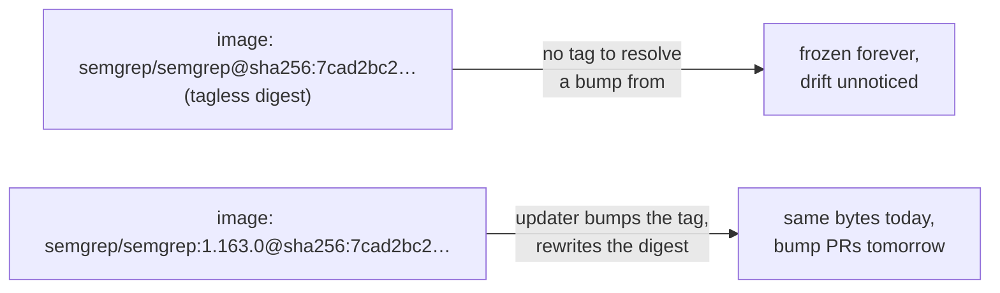

# Carry a trackable release tag beside the semgrep container digest

## Summary

`.github/workflows/semgrep.yml` pinned the job container to a bare digest —
`semgrep/semgrep@sha256:7cad2bc2…` — with no tag beside it. The pin was immutable but untrackable:
Renovate's `docker` manager and Dependabot's `docker` ecosystem both resolve a version bump from the
**tag** and then rewrite the digest, so with no tag there was nothing to resolve and the image was
frozen at whatever `semgrep/semgrep:latest` happened to be on the day it was captured.

The digest was resolved back to its release tag against the Docker Hub registry API and the pin now
carries both:

```yaml
image: semgrep/semgrep:1.163.0@sha256:7cad2bc2d1e44f87f0bf4be6d1fa23aa90fb72015bebc89fb91385d813987a03
```

The digest is unchanged, so the image the runner pulls is byte-for-byte the same one; only the
trackability changes. The workflow's header comment now also tells the next maintainer to record the
tag and the digest together when bumping.

Closes #825.

## Evidence

CI configuration change — no web interface to screenshot. Verification is the registry lookup below
plus the new unit test.

The tag was confirmed authoritative against the registry (not just Docker Hub's tag listing):

```text
$ curl -sI -H "Authorization: Bearer $TOKEN" \
    https://registry-1.docker.io/v2/semgrep/semgrep/manifests/1.163.0
content-type: application/vnd.oci.image.index.v1+json
docker-content-digest: sha256:7cad2bc2d1e44f87f0bf4be6d1fa23aa90fb72015bebc89fb91385d813987a03
```

`semgrep/semgrep:1.163.0` resolves to exactly the pinned digest, and it is still the multi-arch OCI
image index, so the runner keeps resolving its own architecture from the index.



Test run — the new test observed failing against the tagless pin, then passing after the fix:

```text
# before the fix
semgrep workflow — digest pin carries a trackable release tag ... FAILED
  job 'semgrep' container image 'semgrep/semgrep@sha256:7cad2bc2…' pins a digest with no tag
  beside it.

# after the fix
semgrep workflow — digest pin carries a trackable release tag ... ok (577µs)
ok | 7 passed | 0 failed
```

`./quality.sh` was run in full. Format, lint and type check are clean. The two failures it reports
are the pre-existing container Rust-toolchain problem already recorded on #819/#820 — the toolchain
install ends with `ERROR: rustup installation appears incomplete`, so
`common/ensure_neat_ai_native_scorer_test.ts` (`preamble failed (exit 1)`) and the examples that
need the native scorer abort. Neither touches this change, which only edits a workflow YAML and a
workflow test.

## Test Plan

- Added
  `.github/semgrep_workflow_test.ts::semgrep workflow — digest pin carries a trackable
  release tag`
  — parses the workflow and asserts every job-level container image carries a tag beside its digest,
  and that the tag is not the floating `latest` (which no updater can bump from). Observed red
  before the change and green after it.
- Existing suites still pass: the other four `.github/semgrep_workflow_test.ts` tests (including the
  #555 digest-pin guard) and both `semgrep_workflow_credential_test.ts` tests.
- Refactored the image lookup in that file into a shared `containerImages()` helper so the digest
  test and the new tag test read the workflow the same way — no assertion was removed or weakened.
