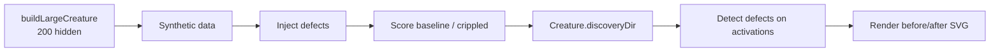

## Summary

Adds a new `discovery_at_scale/` example demonstrating the NEAT-AI Discovery pipeline against a
creature large enough that random mutation alone cannot recover from injected damage (~200 hidden
neurons, ~1 k synapses). The demo injects a mix of structural defects (saturated, dead, dormant,
dormant synapses, bottleneck), runs `Creature.discoveryDir(...)`, and renders a before/after
topology SVG with a defect-category legend. Closes #84.

## Evidence

The change is a new CLI example with deterministic SVG output — no UI to screenshot beyond the SVG
itself. The demo emits `docs/screenshots/discovery_at_scale.svg` (committed) which shows the
before/after topology side-by-side, the legend mapping defect categories to colours, and a summary
panel with baseline / crippled / discovered scores plus a per-category defect tally.

End-to-end run on a developer machine (M-series Mac):

```
baseline score   = 0.999969
crippled score   = 0.983520
discovered score = 0.987691
discovery wall-clock = 6485ms
```

Demo wall-clock: ≈ 6.5 s — well under the 2-minute cap from the issue.



## Test Plan

- [x] `deno fmt --check` — passes
- [x] `deno lint` — passes
- [x] `deno check **/*.ts` — passes
- [x] `deno test discovery_at_scale/` — 11/11 pass, including:
  - `injectDefects` — produces requested counts, all in hidden range, rebuilt creature validates.
  - `snapshotTopology` — flags injected saturated neurons, flags dormant synapses, classifies
    inputs/outputs as healthy.
  - `loadDatasetSamples` — round-trips samples written by `generateSyntheticData`.
  - `renderDiscoveryAtScaleSVG` — produces a non-empty SVG containing every defect-category colour,
    byte-deterministic for identical inputs.
  - `crippled creature scores worse than baseline on its own data` — verifies the injected defects
    materially harm the crippled creature.
  - `runDiscoveryAtScaleDemo - completes end-to-end and writes a non-empty
    SVG (small config)` —
    full pipeline with the FFI library actually running discovery.
- [x] Repository-wide test suite: `deno test` — 690/690 pass.
- [x] `readme_structure_test.ts` updated to include `discovery_at_scale` in the per-example README
      check; new entry added to the main `README.md` examples table.
- [x] `quality.sh` updated to include `./discovery_at_scale/run.sh` and to clean up
      `.discovery-at-scale/` between runs.

## Files

- `discovery_at_scale/discovery_at_scale.ts` — main pipeline.
- `discovery_at_scale/svg.ts` — deterministic before/after SVG renderer.
- `discovery_at_scale/discovery_at_scale_test.ts` — 11 "what" tests.
- `discovery_at_scale/discovery_at_scale_bench.ts` — micro-benchmarks.
- `discovery_at_scale/run.sh` — CLI runner mirroring the existing `discovery/run.sh`.
- `discovery_at_scale/README.md` — explains the defect taxonomy and links to NEAT-AI-Discovery for
  the full 40+ scenario list.
- `docs/screenshots/discovery_at_scale.svg` — committed reference image.
- `README.md`, `readme_structure_test.ts`, `quality.sh` — registration.
