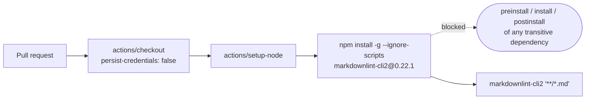

## Summary

The CI `markdownlint-cli2` install in `.github/workflows/markdown-lint.yml` was pinned to an exact
version (#442) but still ran with npm's default lifecycle-script behaviour: `npm install` executes
any `preinstall` / `install` / `postinstall` script declared by `markdownlint-cli2` **or by any of
its transitive dependencies**, whose versions nothing in this repository pins. Every pull request —
including one from a fork — triggers that job, so a compromised dependency would have executed
attacker code on the runner with no PR-side action required.

The install now passes `--ignore-scripts`, and the rule is held for the whole repository by a new
supply-chain policy test that walks every committed workflow and composite action, alongside the
existing SHA-pin and verified-download policies.

`--ignore-scripts` is passed on the command line rather than through a repository `.npmrc`: hidden
files outside the project allowlist are not committed here, and a flag at the point of use is
visible in the CI run log.

The issue also floated routing the install through `.github/scripts/install_verified_tool.sh`. That
helper verifies a release tarball's SHA-256 and extracts **one static binary** — `markdownlint-cli2`
is a Node package that needs its dependency tree installed, so the helper does not fit it, and
adopting a lockfile-based npm install for a single CI tool is a larger change than this issue asks
for. It is explicitly a "consider" in the issue, not the trigger being closed here.

Closes #849.

## Evidence

This is a CI/supply-chain change with no web interface to screenshot. Evidence is the test run plus
a real install of the pinned package under the new flag.

The regression test failed against the unfixed workflow:

```text
markdown-lint workflow — the npm install runs no lifecycle scripts (#849) => FAILED
npm policy — no workflow installs an npm package with lifecycle scripts enabled ... markdown-lint.yml => FAILED
  AssertionError: markdown-lint.yml: the following must pass --ignore-scripts, so a compromised
  package or transitive dependency cannot execute a lifecycle script on the runner.
  Actual: [ "job 'markdownlint' step 'Install markdownlint-cli2'" ]
FAILED | 23 passed (31 steps) | 2 failed (1 step)
```

And passes after the fix:

```text
deno test --no-check --allow-read .github/markdown_lint_workflow_test.ts .github/workflow_pin_policy_test.ts
ok | 25 passed (32 steps) | 0 failed (78ms)
```

The guarded install was also exercised for real, to prove `--ignore-scripts` does not break the tool
(npm 12.0.2 in the run container):

```text
npm install --prefix /tmp/mdl849 --global --ignore-scripts markdownlint-cli2@0.22.1  → exit=0
/tmp/mdl849/bin/markdownlint-cli2 --version → markdownlint-cli2 v0.22.1 (markdownlint v0.40.0)
```

### Original trigger, closed

The trigger was: open or push to any pull request, and the `markdown-lint` job runs
`npm install -g markdownlint-cli2@0.22.1` with npm's default lifecycle-script behaviour. That exact
command no longer exists — the only npm invocation in the tree is
`npm install -g --ignore-scripts markdownlint-cli2@0.22.1`, so npm runs no `preinstall`, `install`
or `postinstall` script for the package or for any transitive dependency, and the
arbitrary-code-execution path the issue describes is closed.

There is no trivial bypass, because the gate is a repository-wide policy rather than a check of one
line: `npmInstallsRunningLifecycleScripts()` parses every workflow under `.github/workflows` and
every composite action under `.github/actions`, judges each logical command line on its own (a
guarded install on one line does not excuse an unguarded one on the next), joins backslash
continuations so the flag cannot be lost across lines, and covers `npm install`, `npm i`, `npm add`,
`npm ci`, `npm exec` and `npx`. Re-introducing an unguarded install anywhere in CI — under a new
step name, a new workflow file, or a different npm spelling — turns the suite red.



## Test Plan

- Added
  `.github/markdown_lint_workflow_test.ts::markdown-lint workflow — the npm install runs no
  lifecycle scripts (#849)`
  — the regression test. It parses the workflow YAML, asserts the `markdownlint-cli2` install step
  passes `--ignore-scripts`, and asserts no step in the workflow breaches the repository-wide
  policy. Observed failing against the unfixed workflow (output above) and passing after the fix.
- Added
  `.github/workflow_pin_policy_test.ts::npm policy — no workflow installs an npm package with
  lifecycle scripts enabled`
  and `…::npm policy — no composite action installs an npm package with
  lifecycle scripts enabled`
  — the same rule applied to every committed workflow and composite action, so a new CI tool is
  covered the moment it is committed. The first of these was also observed failing before the fix.
- Added four unit tests that prove the gate catches offenders rather than merely passing on a
  compliant tree, exercising `npmInstallsRunningLifecycleScripts()` against hand-built documents:
  `npm policy — flags a version-pinned global install that still runs scripts`,
  `npm policy — flags npm ci, the i/add aliases and the npx runner`,
  `npm policy — flags a multi-command block where only one install is guarded`,
  `npm policy — accepts a guarded install split over a line continuation`, and
  `npm policy — ignores steps that never invoke npm`.
- No existing test was modified or removed.
