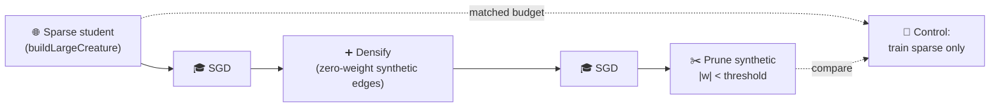

# Add synthetic synapse training demo (densify-then-prune)

## Summary

Adds a new `synthetic_synapse/` example that demonstrates NEAT-AI's synthetic-synapse training
technique — temporarily densifying the inter-layer connectivity of an evolved sparse creature,
training every weight with SGD, then pruning the synthetic synapses whose magnitude stayed near
zero. Closes #85.

The example is built on top of `buildLargeCreature` (#83) using small defaults (4 inputs, 12 hidden,
2 outputs, density 0.18) so the full run — sparse → densified → pruned plus a matched-budget control
— completes in well under a second on a developer machine, far inside the two-minute acceptance
bound.



## Evidence

CLI demo run output:

```
   phase         synapses   held-out score
   sparse              26       -0.0525362
   densified           85       -0.0514980
   pruned              33       -0.0514980
   control             26       -0.0514980

   pruned − control = 0.000 (no regression — synthetic synapses help)
```

The rendered SVG showing three topology snapshots and the synapse-count / held-out-score bar chart
is committed at:


A mirror copy is also written to `.synthetic-synapse/output/synthetic_synapse.svg` to satisfy the
`output/synthetic_synapse.svg` location called out in the issue.

`./quality.sh` passes (lint, fmt, type check, 648 unit tests, all 16 example runners including the
new one).

## Test Plan

19 new unit tests in `synthetic_synapse/synthetic_synapse_example_test.ts` verify:

- `forward` returns finite outputs of the correct shape and rejects mismatched input length.
- `generateDataset` is deterministic for a given seed and rejects non-positive sizes.
- `trainNetwork` measurably improves held-out score (regression test against silent SGD breakage).
- `densify` adds zero-weight synthetic synapses without changing forward output and is idempotent.
- `prune` removes synthetic synapses below the threshold while preserving every original synapse.
- `runSyntheticSynapseDemo` produces three phases in the right order with `densified > sparse` and
  `pruned < densified` synapse counts.
- The pruned held-out score does not regress versus the matched-budget control (acceptance
  criterion: "held-out score does not regress versus the control run").
- The whole run is byte-deterministic for the same config.
- The rendered SVG is well-formed, embeds all three phase labels, addresses original vs. synthetic
  synapses through their own CSS classes, and rejects malformed phase ordering.

Additional repo-wide changes:

- `quality.sh` cleans up the new `.synthetic-synapse` working dir and runs the new example.
- `README.md` lists the new example in the at-a-glance table.
- `readme_structure_test.ts` asserts the new per-example README is wired up.
- `docs/archive_test.ts` allowlist refreshed so the pre-existing `pr-summary-83/96/106.md` files
  (and the new `pr-summary-85.md`) are recognised.

Tests added/modified:

- `synthetic_synapse/synthetic_synapse_example_test.ts` — 19 new tests.
- `synthetic_synapse/synthetic_synapse_example_bench.ts` — benchmarks for the per-phase cost and the
  full demo.
- `readme_structure_test.ts` — added `synthetic_synapse` to the example enumeration so the
  structural assertions cover the new example.
- `docs/archive_test.ts` — allowlist refresh as noted above.
